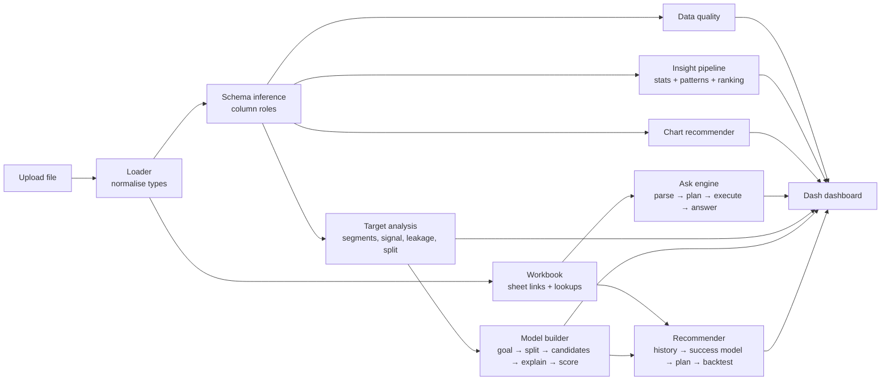

<div align="center">

# AI Data Scientist Platform

**Upload any dataset. Understand it in seconds. Ask questions in plain English. Get model-ready insight.**
*Growing into a goal-driven AutoML platform with LLM, RAG and agentic AI on Azure.*


</div>

---

## Table of contents

- [Overview](#overview)
- [Project status](#project-status)
- [Screenshots](#screenshots)
- [Features](#features)
- [How it works](#how-it-works)
- [Quick start](#quick-start)
- [Usage examples](#usage-examples)
- [Project structure](#project-structure)
- [Design principles](#design-principles)
- [Testing](#testing)
- [Roadmap](#roadmap)
- [Tech stack](#tech-stack)
- [Documentation](#documentation)
- [Data notice](#data-notice)
- [Author](#author)
- [License](#license)

---

## Overview

Most EDA tools show charts; this project aims to behave like a **data scientist**. It:

1. **understands any table on its own** — column roles, data quality, relationships between sheets, the likely prediction target — with **no hardcoded column names**;
2. **answers plain-English questions by computing on the data** ("which doctors in Pune North were visited in March 2025?", "pie chart of doctors by specialty");
3. **prepares a dataset for machine learning** — target rate by segment, feature signal, leakage checks, panel detection and a time-aware train/test split;
4. **builds models from a goal** — pick *predict a yes/no outcome*, *rank / prioritise* or *predict a number*; it proposes features, excludes leaky columns, compares models against a baseline on an honest split, explains the winner and scores the latest rows;
5. **recommends next contacts** — learns which interactions succeed from point-in-time history and plans each user's next working days within their group (e.g. daily doctor visits per MR per territory), with a backtest against simple rules.

The long-term goal (see [Roadmap](#roadmap)): the user states **what they want to achieve** — *predict, forecast, recommend, segment, find anomalies* — and the platform formulates the problem, trains and evaluates suitable models, and explains the results. An LLM acts as the **orchestrator**; tested Python pipelines do the computation, so numbers are never invented.

The real-world use case is a **pharma Sales Force Automation (SFA)** app: doctor prioritisation, daily visit plans for medical representatives (MRs), territory forecasts and a manager assistant. The engine itself is domain-agnostic and is tested on unrelated synthetic datasets.

## Project status

| Phase | Capability | Status |
|---|---|---|
| 0 | Generic schema inference (roles, kinds, primary time axis) | ✅ Done |
| 1 | Dashboard: overview, data quality, recommended charts, ranked insights, chart builder, Ask box, pin board | ✅ Done |
| 1.5 | Ask box v2: lists, date filters, chart requests, fuzzy matching · multi-sheet linking and question routing | ✅ Done |
| 2 | Target-aware EDA: target detection, segment rates, feature signal, leakage checks, time-split advice, report | ✅ Done |
| 3a | Goal-driven model builder: classification, ranking, regression with explanations, scoring and a model registry | ✅ Done |
| 3b | Recommendation: next-best-contact model, daily plan per user within their group, backtest | ✅ Done |
| 3c–3d | Forecasting, clustering, segmentation and anomaly detection | 🔜 Next |
| 4–5 | "Why" analysis tools, KPI layer, FastAPI service | 📋 Planned |
| 6–8 | LLM layer, RAG with citations, agentic AI (AutoML orchestrator, analyst agent, MCP server) | 📋 Planned |
| 9–11 | Azure (Bicep), .NET SFA integration + Manager Agent, evaluation and governance | 📋 Planned |

## Screenshots

**Overview** — schema, column roles, data-quality findings and preview, inferred automatically


<details>
<summary><b>Ask</b> — plain-English questions answered by computing on the data (click to expand)</summary>


</details>

<details>
<summary><b>Target</b> — training-table EDA: imbalance, time split, segments, drift, feature signal (click to expand)</summary>


</details>

<details>
<summary><b>Build model</b> — goal → proposed setup → model comparison, gains, drivers, ranked predictions with reasons (click to expand)</summary>


</details>

<details>
<summary><b>Recommend</b> — roles → backtest of strategies → daily plan per user with reasons (click to expand)</summary>


</details>

<details>
<summary><b>Auto insights</b> — recommended charts and ranked findings (click to expand)</summary>


</details>

## Features

### Automatic dataset understanding
- Loads CSV, TSV, Excel (every sheet), JSON and Parquet; normalises numbers and dates (without mistaking codes such as `ST001` for dates).
- Infers each column's **role** — measure, category, yes/no, date/time, ID/key, free text — and picks the primary time axis.
- **Data-quality checks:** missing values, duplicates, impossible negatives, outliers, skew, inconsistent labels, imbalance, date problems.

### Intelligent EDA
- **Recommended charts** ranked by how much they reveal (group differences, trends, correlations), with near-duplicates removed.
- **Ranked insights** with evidence and plain-language explanations.
- **Chart builder** with sensible defaults; any chart can be **pinned** to a personal board.

### Ask in plain English (no LLM required)
- Counts, sums, averages, min/max, top/bottom N, grouping, filters.
- **Lists** of entities with their descriptive columns ("which doctors are in Pune North?").
- **Dates:** "in March", "March 2025", "Q1 2025", "in 2024" — the date column is chosen from the question's wording.
- **Chart requests:** "pie / bar / line chart of X by Y", "according to", "per", "X-wise", "by month".
- **Robust input:** ID codes without leading zeros (`MR01` = `MR001`), spelling variants (`speciality` → `Specialty`), run-together words (`doctorsId`, `NorthTerritory`).
- **Never misleading:** names values it can't find (and which sheet has them) instead of returning every row.

### Multi-sheet workbooks
- Detects links between sheets from shared key columns (e.g. `Visits.DoctorId → Doctors.DoctorId`, `Visits.MRId → MRs → Users`).
- Adds lookup columns so questions can use details from linked sheets; clashing names are labelled (`Doctors Territory` vs `MRs Territory`).
- **Routes a question to the sheet that can answer it** and says so in the answer.

### Target-aware EDA (preparing for ML)
- Proposes the **prediction target** from column roles, values and names; any column can be chosen.
- **Target rate by segment** with chi-square tests and Cramér's V; **feature signal** via univariate AUC (binary) or Spearman correlation (numeric).
- **Leakage checks:** near-perfect predictors, copies of the target, future-sounding names, dates after the snapshot period; IDs and dates excluded from features with reasons.
- **Panel detection** (entity × period) and a **time-based split** recommendation, with drift over time and imbalance advice.
- One-click **Markdown report** ([example](docs/examples/target_report_NextMonthOrder.md)).

### Goal-driven model builder (AutoML, Phase 3a)
- **"What do you want to build?"** — *rank / prioritise*, *predict a yes/no outcome* or *predict a number*; the target list is filtered to columns that fit the goal.
- **Proposed setup** reused from the target analysis: features from column roles; IDs, dates, leaky and very-high-cardinality columns left out with reasons.
- **Honest validation:** time-based train / validation / test windows for dated data (stratified random split otherwise). The model is **chosen on the validation window** and scored **once** on the test period.
- **Candidates vs a baseline:** logistic / ridge regression, random forest, gradient boosting, and a no-feature baseline.
- **Metrics in plain words:** PR-AUC, ROC-AUC, top-20% capture and lift, cumulative gains (yes/no); MAE, RMSE, R² (numbers).
- **Explanations:** permutation importance, plus per-row reasons ("high Order Rate (0.81, top 1%)").
- **Scores the rows that need a prediction** (unlabelled rows or the latest period), CSV download, and a **local model registry** (`models/`, joblib + JSON metadata).
- Training runs in the **background**; the page stays usable and shows progress.

### Recommendation and daily plans (Phase 3b)
- **Finds the interaction table** in a workbook (e.g. *Visits*, even when another sheet is selected) and proposes the roles: **user** (MR), **item** (doctor), **date**, **outcome**, **success values** (negations such as *Not Interested* are never pre-selected) and the **planning group** matched across sheets (*MRs Territory* ↔ *Doctors Territory*). Everything is editable.
- **Point-in-time history features** per contact, computed only from earlier contacts: days since last contact / success, prior contacts and successes, prior success rate, contacts in the last 90 days, last outcome — plus item attributes.
- **Success model** trained with the Phase 3a builder (time split, candidates vs baseline, explanations).
- **Daily planner:** for each working day and user, the best-scoring items in the user's group, with a daily capacity and a minimum gap between contacts (both defaulted from history). Every rule is enforced and tested.
- **Backtest on held-out weeks:** success rate of the contacts each strategy would prioritise — *Model*, *Most overdue first*, *Highest past success rate*, *Random*.
- Plan with reasons, summary per group, CSV download.

## How it works



**Ask pipeline:** the question is parsed into intent, entity, filters, dates and chart type using the dataset's own column names and values → a validated query plan → executed with pandas → turned into a sentence, a table and (if useful) a chart. If the selected sheet can't answer, every linked sheet is tried and the best one is used.

More detail: [docs/ARCHITECTURE.md](docs/ARCHITECTURE.md).

## Quick start

**Requirements:** Python 3.10+ (developed on 3.12).

```bash
git clone https://github.com/kulkarniDurvesh/ai-data-scientist-platform.git
cd ai-data-scientist-platform

python -m venv .venv
# Windows
.venv\Scripts\activate
# macOS / Linux
source .venv/bin/activate

pip install -r requirements.txt
```

Run the dashboard:

```bash
python app.py                                  # start empty, upload a file in the browser
python app.py --file path/to/data.xlsx         # preload a dataset
python app.py --file data.xlsx --sheet Visits  # pick an Excel sheet
python app.py --port 8060 --debug              # other port, Dash dev tools
```

Then open <http://127.0.0.1:8050>. Deep links open a tab directly: `?tab=overview|auto|builder|ask|target|model|recommend|board`.

## Usage examples

Real outputs from the engine (full list with tables: [docs/examples/ask_examples.md](docs/examples/ask_examples.md)):

| Question | Answer |
|---|---|
| `which doctors are present in Pune North territory` | Found 50 doctors where Territory is Pune North. *(table with name, specialty, territory)* |
| `Among the Pune North Territory can you give me pie chart of doctors according to their speciality` | Pie chart · 4 groups; Cardiology is the largest (13 of 50). |
| `give list of doctors visited in month of March by MR01` | Found 34 doctors where Visit Date is in March and MRId is MR001. March appears in 2024 and 2025… *Answered from the 'Visits' sheet, with details from the 'Doctors' sheet.* |
| `how many doctors were visited in Q1 2025` | There are 498 doctors matching Last Visit Date is in Q1 2025. |
| `list all gizmos` | I couldn't match any column or value in that question… *(instead of returning every row)* |

The same engine on an unrelated retail dataset:

| Question | Answer |
|---|---|
| `list customers who ordered in March 2024` | Found 73 customers where order_date is in March 2024. |
| `In North, give me a pie chart of customers according to their categry` | Pie chart · 3 groups; Technology is the largest (134 of 380). |

Target analysis of `NextMonthOrder` (excerpt of the [generated report](docs/examples/target_report_NextMonthOrder.md)):

> Positive rate 7.52% · panel data 500 doctors × 21 months · **warning:** class imbalance (always predicting "no" would score 92.5%) · **split by time:** train Mar 2024–Jul 2025 (8,500 rows), test Aug–Nov 2025 (2,000 rows) — a random split would put ~99% of doctors in both sets · strongest segment: Territory (Solapur 11.8% vs Satara 5.5%, p = 4.4e-13) · strongest features: OrderRate, OrdersPlaced (AUC ≈ 0.89).

Build model, goal *Rank / prioritise*, target `NextMonthOrder` (time split: train Mar 2024–Jul 2025, test Aug–Nov 2025):

| Model | Validation PR-AUC | Test PR-AUC | Test ROC-AUC | Top 20% capture |
|---|---|---|---|---|
| Baseline (no features) | 0.073 | 0.077 | 0.500 | 16% |
| **Logistic regression (chosen)** | **0.442** | 0.405 | 0.922 | 85% |
| Random forest | 0.398 | 0.488 | 0.926 | 86% |
| Gradient boosting | 0.395 | 0.494 | 0.911 | 84% |

> The top 20% of the ranked doctor list captures **85% of next-month orderers** (4.3× the average rate). The model is selected on the validation window, not on the test period — which is why the slightly better test scores of the tree models don't change the choice.

Recommend tab on the *Visits* sheet (success = *Order Placed* or *Interested*, plan within territory, 6 visits per MR per day, 5 working days):

| Strategy (top 20% of each held-out week's visits) | Success rate | Lift |
|---|---|---|
| **Model** | **76.8%** | **2.9×** |
| Highest past success rate | 76.5% | 2.9× |
| Most overdue first | 27.9% | 1.05× |
| Random (no prioritisation) | 26.5% | 1.0× |

> Prioritising by the model nearly triples the success rate of visits. In this synthetic data each doctor's propensity is stable, so the simple *past success rate* rule performs almost as well — the backtest makes that visible instead of hiding it. *Most overdue first* does not help. The plan: 384 visits for 50 MRs, each within their territory, at most 6 per day, at least 12 days between visits to the same doctor.

## Project structure

```
.
├── app.py                     # entry point: python app.py [--file ...]
├── core/                      # domain-agnostic analysis engine
│   ├── loader.py              # file loading + type normalisation
│   ├── schema_inference.py    # column roles, naming helpers
│   ├── data_quality.py        # quality checks
│   ├── profiler.py, relationships.py, statistics.py, patterns.py,
│   │   insight_filter.py, evidence.py, explanations.py, ranking.py,
│   │   insight.py, eda_pipeline.py   # automatic insight pipeline
│   ├── date_parts.py          # "March 2025", "Q1" → date filters
│   ├── workbook.py            # multi-sheet links and lookups
│   ├── target_analysis.py     # target-aware EDA + Markdown report
│   ├── modeling/              # goal → features → split → candidates → explain → score → registry
│   ├── recommend/             # roles → point-in-time history → success model → daily plan → backtest
│   └── NLP/                   # Ask engine: parser → planner → engine → answer
├── visualization/             # chart specs, recommender, engine, renderer, validator
├── ui/                        # Dash app: layout, callbacks, panels, state, styles
├── tests/                     # pytest suite on synthetic, non-pharma datasets
└── docs/                      # architecture, user guide, roadmap, screenshots, examples
```

## Design principles

- **Generic by construction** — no column, sheet or dataset names in the code; behaviour comes from data, column roles and naming conventions.
- **Compute, don't guess** — every number comes from deterministic code; future AI layers explain and orchestrate but never invent values.
- **Honest by default** — leakage checks, time-aware splits, baselines, and clear messages when something can't be answered.
- **Tested on unrelated data** — tests use synthetic retail, store and shipment datasets to prove nothing depends on the pharma schema.

## Testing

```bash
pip install -r requirements-dev.txt
python -m pytest -q
```

The suite (65 tests) covers schema inference, data quality, charts, the Ask engine (dates, lists, charts, fuzzy matching, routing), multi-sheet linking, target analysis (leakage, segments, panel split), the model builder (beats the baseline, leak exclusion, non-overlapping time windows, registry round trip, background jobs), the recommender (point-in-time features, every planning rule, backtest beats random, flat tables without lookup sheets) and dashboard rendering.

## Roadmap

| Phase | Plan | Key technologies |
|---|---|---|
| ✅ 3a | Goal-driven model builder: classification, ranking, regression | scikit-learn |
| ✅ 3b | Recommendation: next-best-contact model, daily plans, backtest | scikit-learn |
| **3c–3d** | **Forecasting**, clustering, segmentation, anomaly detection | statsmodels, scikit-learn |
| 4 | "Why" tools (change decomposition, period comparison, attention ranking) and a KPI definitions layer | pandas |
| 5 | Python service with typed endpoints | FastAPI, Pydantic, Docker |
| 6 | LLM layer: one interface for local and cloud models, structured output, LLM fallback for the Ask box, narratives | Ollama, Azure OpenAI |
| 7 | RAG over SOP/policy/product documents with citations and retrieval metrics | ChromaDB, Azure AI Search |
| 8 | Agentic AI: free-text goal → plan → clarifying questions → pipelines; analyst agent; MCP server; multi-agent | Microsoft Agent Framework, MCP |
| 9 | On-demand Azure deployment, deleted automatically after use | Bicep deployment stacks, Container Apps, Key Vault, managed identity |
| 10 | Pharma SFA integration and a .NET Manager Agent | ASP.NET Core, Semantic Kernel / Agent Framework |
| 11 | Evaluation in CI, tracing, security, Responsible AI | GitHub Actions, Application Insights, Entra ID |

Details, done-criteria and learning goals per phase: [docs/ROADMAP.md](docs/ROADMAP.md).

## Tech stack

| Layer | Now | Planned |
|---|---|---|
| Analysis / ML | pandas, NumPy, SciPy, scikit-learn | statsmodels |
| UI | Dash, Plotly | Angular (SFA app) |
| Service | — | FastAPI, Docker |
| AI | Rule-based NL engine | Ollama / Azure OpenAI, RAG, agents, MCP |
| Cloud | — | Azure (Bicep, Container Apps, AI Search, Key Vault, App Insights) |
| Testing | pytest | GitHub Actions, LLM/RAG/agent evaluation sets |

## Documentation

| Document | Contents |
|---|---|
| [docs/USER_GUIDE.md](docs/USER_GUIDE.md) | Every tab, the questions the Ask box understands, reading the Target tab, troubleshooting |
| [docs/ARCHITECTURE.md](docs/ARCHITECTURE.md) | Modules, data flow, Ask pipeline, sheet linking, target analysis, design decisions |
| [docs/ROADMAP.md](docs/ROADMAP.md) | Phases, deliverables, done-criteria |
| [docs/examples/](docs/examples/) | Real outputs: Ask answers and a generated target report |

## Data notice

The pharma SFA workbook used in the screenshots and examples is **synthetic**, generated for learning; it contains no real doctor, patient or company data. Results on synthetic data demonstrate the method, not business performance.

## Author

**Durvesh Kulkarni** ([@kulkarniDurvesh](https://github.com/kulkarniDurvesh)) — building this project to learn and demonstrate end-to-end AI engineering: data understanding, machine learning, LLMs, RAG, agentic AI and Azure.

## License

Released under the [MIT License](LICENSE).
