<div align="center">

# AI Data Scientist Platform

**Upload any dataset. Understand it in seconds. Ask questions in plain English. Get model-ready insight.**
*Growing into a goal-driven AutoML platform with LLM, RAG and agentic AI on Azure.*


</div>

---

## Table of contents

- [Overview](#overview)
- [Project status](#project-status)
- [Screenshots](#screenshots)
- [Features](#features)
- [How it works](#how-it-works)
- [Quick start](#quick-start)
- [Usage examples](#usage-examples)
- [Project structure](#project-structure)
- [Design principles](#design-principles)
- [Testing](#testing)
- [Roadmap](#roadmap)
- [Tech stack](#tech-stack)
- [Documentation](#documentation)
- [Data notice](#data-notice)
- [Author](#author)
- [License](#license)

---

## Overview

Most EDA tools show charts; this project aims to behave like a **data scientist**. It:

1. **understands any table on its own** — column roles, data quality, relationships between sheets, the likely prediction target — with **no hardcoded column names**;
2. **answers plain-English questions by computing on the data** ("which doctors in Pune North were visited in March 2025?", "pie chart of doctors by specialty");
3. **prepares a dataset for machine learning** — target rate by segment, feature signal, leakage checks, panel detection and a time-aware train/test split;
4. **builds models from a goal** — pick *predict a yes/no outcome*, *rank / prioritise* or *predict a number*; it proposes features, excludes leaky columns, compares models against a baseline on an honest split, explains the winner and scores the latest rows;
5. **recommends next contacts** — learns which interactions succeed from point-in-time history and plans each user's next working days within their group (e.g. daily doctor visits per MR per territory), with a backtest against simple rules;
6. **forecasts** any measure over time, in total and per group, choosing among statistical and machine-learning models with a rolling backtest against naive baselines, with forecast intervals;
7. **segments and screens** — groups units into named segments, flags unusual ones with reasons, and reports correlated, redundant and collinear features;
8. **explains why a number changed** — compares periods, follows the group that explains most of the movement down a few levels, flags unusual groups and ranks what needs attention (also from the Ask box: *"why did revenue increase?"*);
9. **computes business KPIs** defined once in an optional domain file (`domains/*.yaml`) — the only place domain terms live — per period and per role, with their definitions;
10. **serves everything over HTTP** — a typed FastAPI service with OpenAPI docs, background jobs and a model-scoring endpoint, packaged with Docker, so other apps (e.g. a .NET field-force app) can use the platform;
11. **understands goals in plain words** — *"plan calls to doctors for each MR next month"* becomes a checked plan (rules first, a local or cloud language model for synonyms), shown as an editable card with questions and choices before the right pipeline runs.

The long-term goal (see [Roadmap](#roadmap)): the user states **what they want to achieve** — *predict, forecast, recommend, segment, find anomalies* — and the platform formulates the problem, trains and evaluates suitable models, and explains the results. An LLM acts as the **orchestrator**; tested Python pipelines do the computation, so numbers are never invented.

The real-world use case is a **pharma Sales Force Automation (SFA)** app: doctor prioritisation, daily visit plans for medical representatives (MRs), territory forecasts and a manager assistant. The engine itself is domain-agnostic and is tested on unrelated synthetic datasets.

## Project status

| Phase | Capability | Status |
|---|---|---|
| 0 | Generic schema inference (roles, kinds, primary time axis) | ✅ Done |
| 1 | Dashboard: overview, data quality, recommended charts, ranked insights, chart builder, Ask box, pin board | ✅ Done |
| 1.5 | Ask box v2: lists, date filters, chart requests, fuzzy matching · multi-sheet linking and question routing | ✅ Done |
| 2 | Target-aware EDA: target detection, segment rates, feature signal, leakage checks, time-split advice, report | ✅ Done |
| 3a | Goal-driven model builder: classification, ranking, regression with explanations, scoring and a model registry | ✅ Done |
| 3b | Recommendation: next-best-contact model, daily plan per user within their group, backtest | ✅ Done |
| 3c | Forecasting: series building, rolling backtest of 7 models vs baselines, forecasts with intervals | ✅ Done |
| 3d | Segments: k-means or bands with readable profiles, anomaly detection with reasons, correlation / redundancy / VIF report | ✅ Done |
| 4a | Investigate: period comparison, drill-down explanation (sums and mix / rate for averages), unusual groups, attention ranking, why-questions in Ask | ✅ Done |
| 4b | KPIs: optional domain files with roles and safe KPI formulas, per period and per role, starter file generator | ✅ Done |
| 5 | HTTP API: FastAPI + Pydantic, 21 endpoints, background jobs, saved-model scoring, API key, CORS, Docker / compose | ✅ Done |
| 6a | LLM layer (Ollama / Azure OpenAI, validated structured output) and the **free-text goal box**: hybrid interpreter, validation with questions, editable card, suggestions from the data, goal API | ✅ Done |
| 6b | LLM fallback for the Ask box (validated query, computed by pandas), summaries grounded in computed facts with a number check, evaluation sets with a runner | ✅ Done |
| 7 | RAG over documents with citations and retrieval metrics | 🔜 Next |
| 8 | Agentic AI (AutoML orchestrator, analyst agent, MCP server) | 📋 Planned |
| 9–11 | Azure (Bicep), .NET SFA integration + Manager Agent, evaluation and governance | 📋 Planned |

## Screenshots

**Overview** — schema, column roles, data-quality findings and preview, inferred automatically

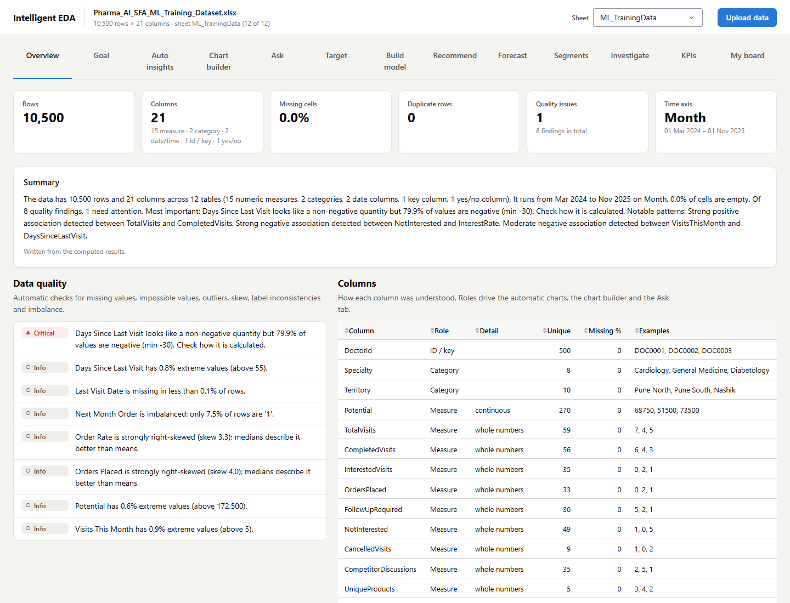

<details>
<summary><b>Ask</b> — plain-English questions answered by computing on the data (click to expand)</summary>

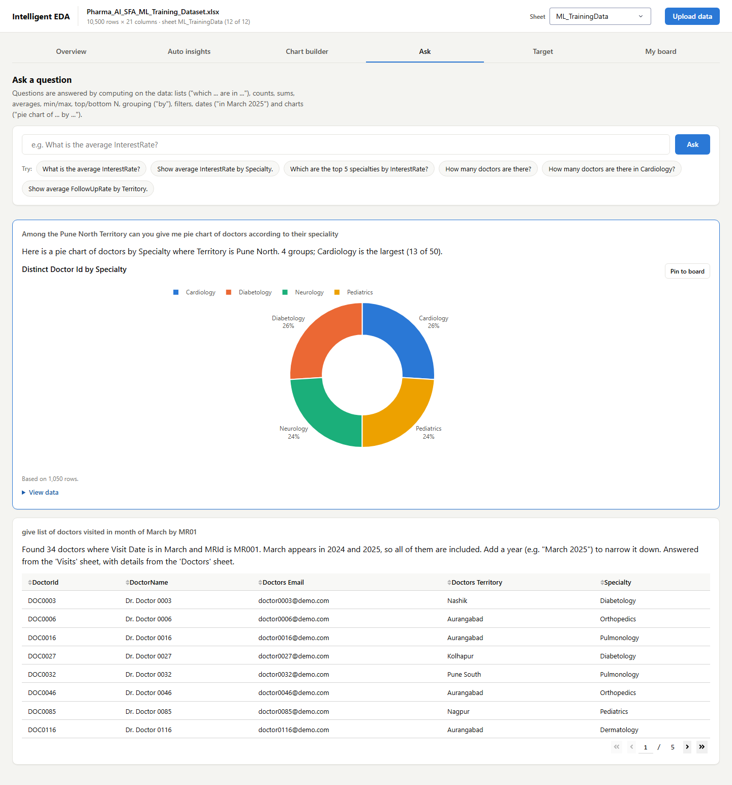

</details>

<details>
<summary><b>Target</b> — training-table EDA: imbalance, time split, segments, drift, feature signal (click to expand)</summary>

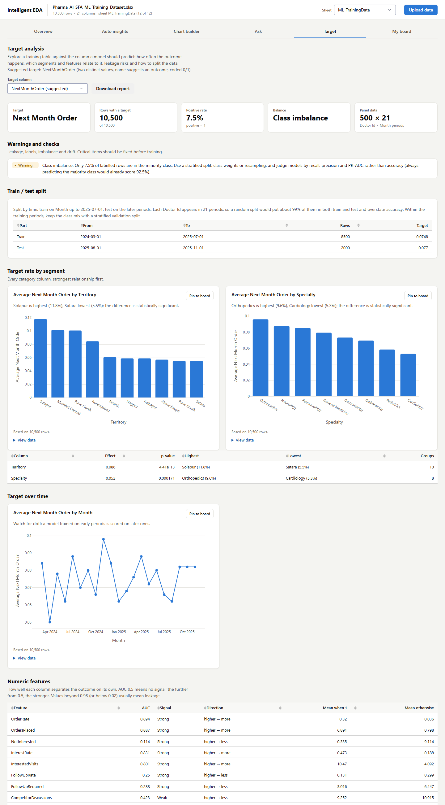

</details>

<details>
<summary><b>Build model</b> — goal → proposed setup → model comparison, gains, drivers, ranked predictions with reasons (click to expand)</summary>

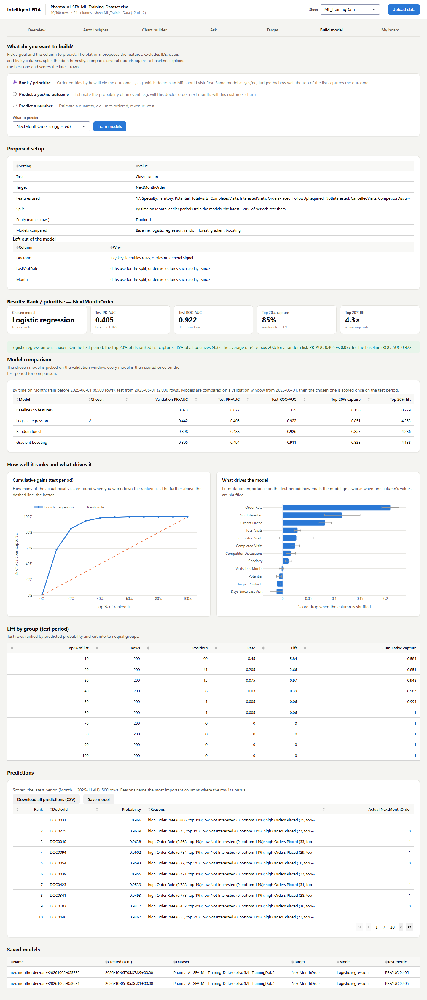

</details>

<details>
<summary><b>Recommend</b> — roles → backtest of strategies → daily plan per user with reasons (click to expand)</summary>

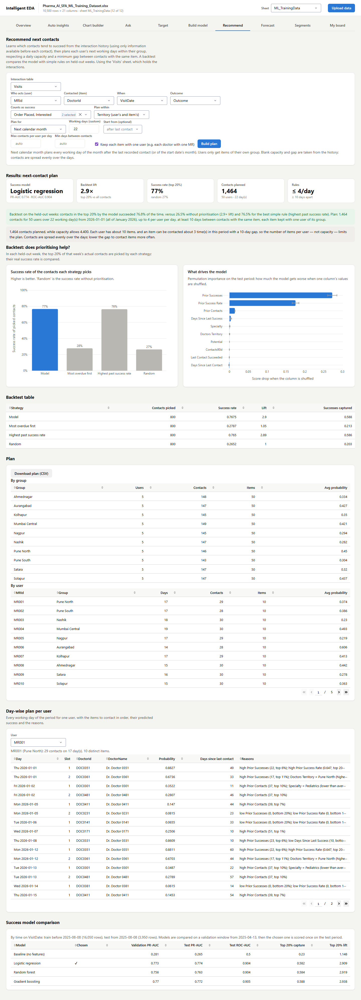

</details>

<details>
<summary><b>Forecast</b> — measure over time: backtested models, forecast with 80%/95% intervals, per-group series (click to expand)</summary>

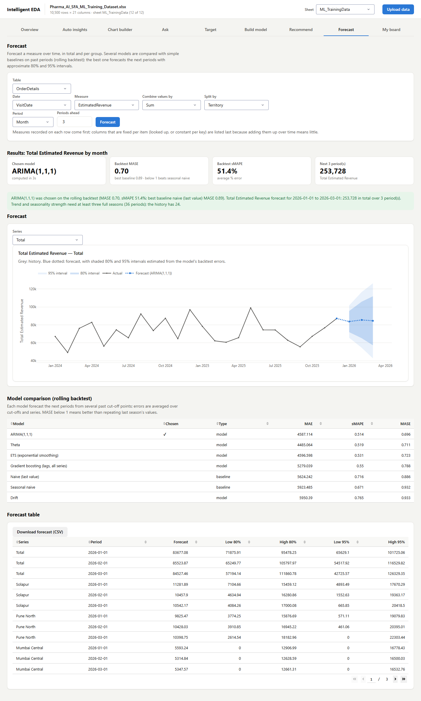

</details>

<details>
<summary><b>Segments</b> — named segments, map and profile heatmap, unusual units with reasons, correlations (click to expand)</summary>

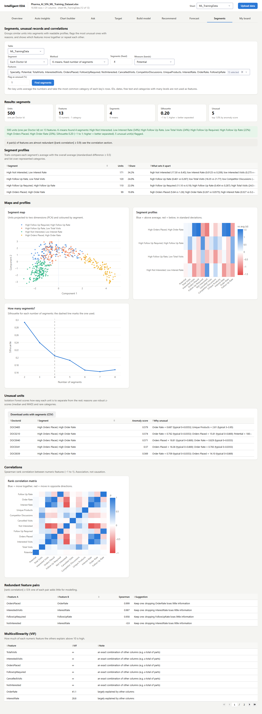

</details>

<details>
<summary><b>Investigate</b> — why a number changed: explanation chain, trend, waterfall, contributions, attention ranking (click to expand)</summary>

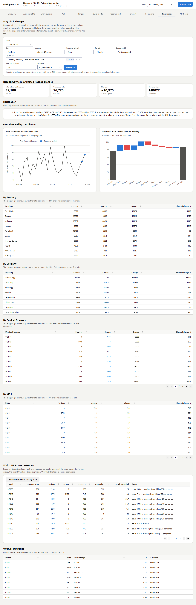

</details>

<details>
<summary><b>KPIs</b> — business KPIs from a domain file: current vs previous, trend, breakdown by role, definitions (click to expand)</summary>

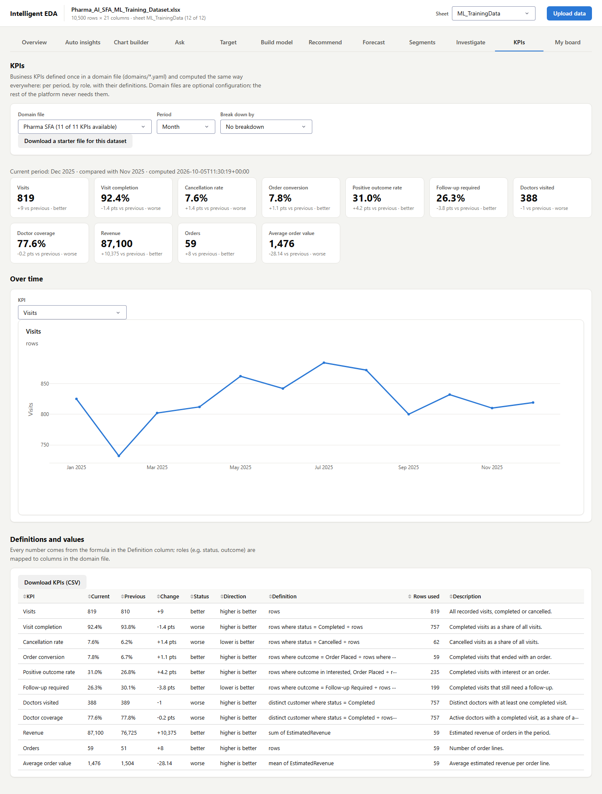

</details>

<details open>
<summary><b>Goal box</b> — a goal in plain words becomes a checked, editable plan (click to collapse)</summary>

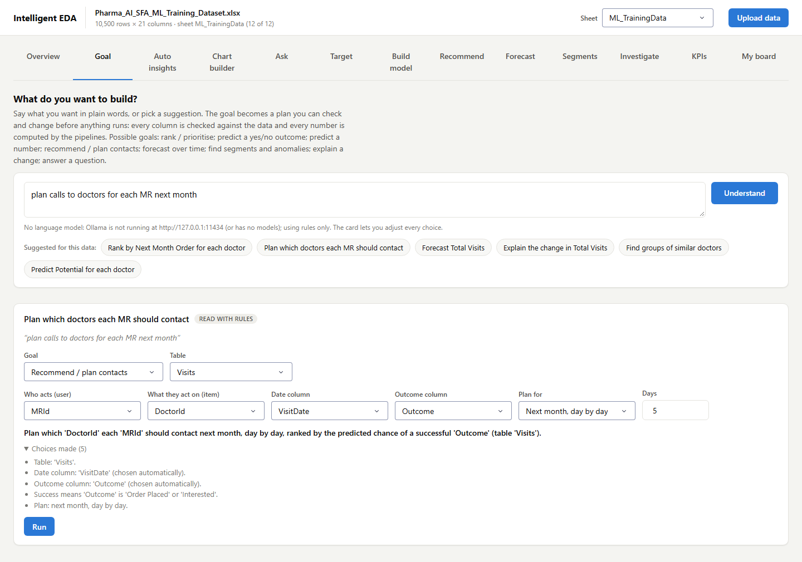

</details>

<details>
<summary><b>HTTP API</b> — interactive OpenAPI documentation at /docs (click to expand)</summary>

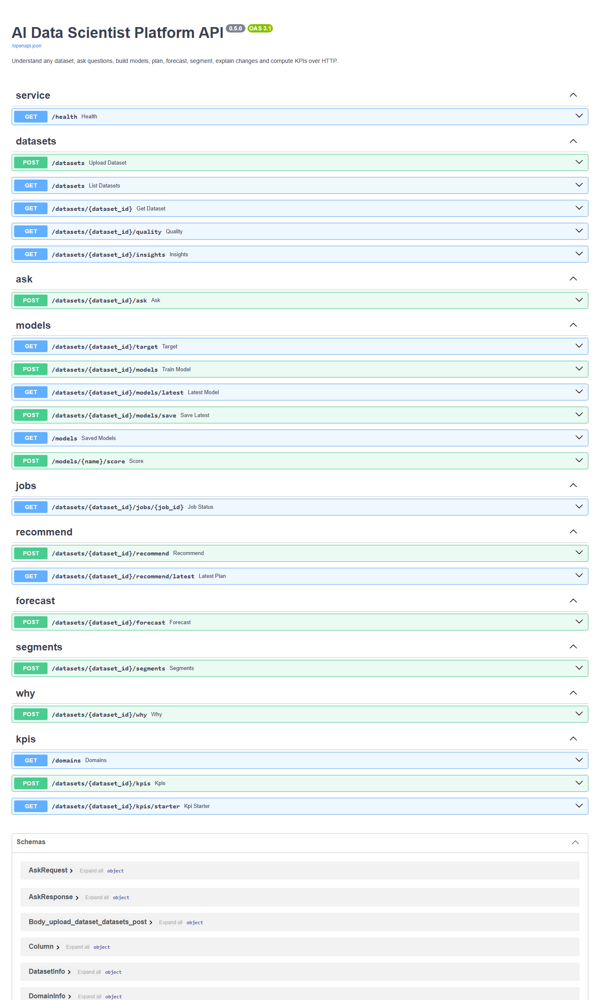

</details>

<details>
<summary><b>Auto insights</b> — recommended charts and ranked findings (click to expand)</summary>

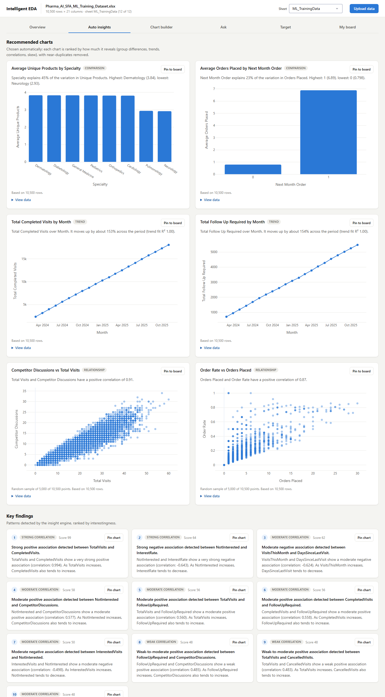

</details>

## Features

### Automatic dataset understanding
- Loads CSV, TSV, Excel (every sheet), JSON and Parquet; normalises numbers and dates (without mistaking codes such as `ST001` for dates).
- Infers each column's **role** — measure, category, yes/no, date/time, ID/key, free text — and picks the primary time axis.
- **Data-quality checks:** missing values, duplicates, impossible negatives, outliers, skew, inconsistent labels, imbalance, date problems.

### Intelligent EDA
- **Recommended charts** ranked by how much they reveal (group differences, trends, correlations), with near-duplicates removed.
- **Ranked insights** with evidence and plain-language explanations.
- **Chart builder** with sensible defaults; any chart can be **pinned** to a personal board.

### Ask in plain English (no LLM required)
- Counts, sums, averages, min/max, top/bottom N, grouping, filters.
- **Lists** of entities with their descriptive columns ("which doctors are in Pune North?").
- **Dates:** "in March", "March 2025", "Q1 2025", "in 2024" — the date column is chosen from the question's wording.
- **Chart requests:** "pie / bar / line chart of X by Y", "according to", "per", "X-wise", "by month".
- **Robust input:** ID codes without leading zeros (`MR01` = `MR001`), spelling variants (`speciality` → `Specialty`), run-together words (`doctorsId`, `NorthTerritory`).
- **Never misleading:** names values it can't find (and which sheet has them) instead of returning every row.

### Multi-sheet workbooks
- Detects links between sheets from shared key columns (e.g. `Visits.DoctorId → Doctors.DoctorId`, `Visits.MRId → MRs → Users`).
- Adds lookup columns so questions can use details from linked sheets; clashing names are labelled (`Doctors Territory` vs `MRs Territory`).
- **Routes a question to the sheet that can answer it** and says so in the answer.

### Target-aware EDA (preparing for ML)
- Proposes the **prediction target** from column roles, values and names; any column can be chosen.
- **Target rate by segment** with chi-square tests and Cramér's V; **feature signal** via univariate AUC (binary) or Spearman correlation (numeric).
- **Leakage checks:** near-perfect predictors, copies of the target, future-sounding names, dates after the snapshot period; IDs and dates excluded from features with reasons.
- **Panel detection** (entity × period) and a **time-based split** recommendation, with drift over time and imbalance advice.
- One-click **Markdown report** ([example](docs/examples/target_report_NextMonthOrder.md)).

### Goal-driven model builder (AutoML, Phase 3a)
- **"What do you want to build?"** — *rank / prioritise*, *predict a yes/no outcome* or *predict a number*; the target list is filtered to columns that fit the goal.
- **Proposed setup** reused from the target analysis: features from column roles; IDs, dates, leaky and very-high-cardinality columns left out with reasons.
- **Honest validation:** time-based train / validation / test windows for dated data (stratified random split otherwise). The model is **chosen on the validation window** and scored **once** on the test period.
- **Candidates vs a baseline:** logistic / ridge regression, random forest, gradient boosting, and a no-feature baseline.
- **Metrics in plain words:** PR-AUC, ROC-AUC, top-20% capture and lift, cumulative gains (yes/no); MAE, RMSE, R² (numbers).
- **Explanations:** permutation importance, plus per-row reasons ("high Order Rate (0.81, top 1%)").
- **Scores the rows that need a prediction** (unlabelled rows or the latest period), CSV download, and a **local model registry** (`models/`, joblib + JSON metadata).
- Training runs in the **background**; the page stays usable and shows progress.

### Recommendation and daily plans (Phase 3b)
- **Finds the interaction table** in a workbook (e.g. *Visits*, even when another sheet is selected) and proposes the roles: **user** (MR), **item** (doctor), **date**, **outcome**, **success values** (negations such as *Not Interested* are never pre-selected) and the **planning group** matched across sheets (*MRs Territory* ↔ *Doctors Territory*). Everything is editable.
- **Point-in-time history features** per contact, computed only from earlier contacts: days since last contact / success, prior contacts and successes, prior success rate, contacts in the last 90 days, last outcome — plus item attributes.
- **Success model** trained with the Phase 3a builder (time split, candidates vs baseline, explanations).
- **Daily planner:** for the next 5 or 10 working days or **the whole next calendar month**, each user gets the best-scoring items **of their own group**, with a maximum per day and a minimum gap between contacts (defaulted from history). **Each item stays with one user** (the in-group user who contacted it most, balanced across the group), and contacts are **spread evenly** over the days. Every rule is enforced and tested.
- **Day-wise plan per user:** pick an MR and see every working day of the month with the doctors to visit in order, predicted success and reasons; plus totals per user and per group.
- **Backtest on held-out weeks:** success rate of the contacts each strategy would prioritise — *Model*, *Most overdue first*, *Highest past success rate*, *Random*.
- Plan with reasons, summary per group, CSV download.

### Forecasting (Phase 3c)
- **Any measure over time:** pick a table, a date column and a measure (or *number of rows*), how to combine values (sum, average, distinct count) and an optional split (e.g. per territory). Measures that are fixed per item (a doctor's potential, a product's price) are listed last.
- **Regular series:** bucketed by day / week / month / quarter (monthly by default for 18+ months of events; snapshot tables keep their own period), gaps filled, an **incomplete last period dropped** so it isn't read as a slump.
- **Seven candidates:** naive and seasonal-naive baselines, drift, ETS (exponential smoothing), Theta, ARIMA(1,1,1) and a global gradient-boosting model on lag features across all series.
- **Rolling-origin backtest:** several past cut-offs, each forecasting the full horizon; MAE, sMAPE and **MASE** (below 1 beats seasonal naive). The best non-baseline model by MASE is used, with a warning if no model beats the baselines.
- **Forecasts with approximate 80% / 95% intervals** from the model's backtest errors; trend and seasonality strength from STL — only reported with three or more full seasons, because two cycles make the seasonal estimate meaningless.
- Chart per series (total or any group), model comparison, forecast table and CSV download.

### Segmentation, anomalies and correlations (Phase 3d)
- **Units:** each row, or one per entity (doctor × month → doctor) with numbers averaged and categories by most common value; panel data defaults to per entity.
- **Segments:** k-means for 2–8 segments chosen by silhouette (or a fixed number), or low / medium / high bands of one measure. Numbers are standardised (log for skewed), categories one-hot and weighted so each column counts about once.
- **Readable names and profiles** from what sets each segment apart — *"High Orders Placed, High Order Rate"*, *"High Not Interested, Low Interest Rate"* — with sizes, a PCA map and a profile heatmap.
- **Unusual units:** Isolation Forest flags the top share (default 1%), with reasons from robust z-scores (median / MAD) and rare categories — *"Order Rate = 0.69 (typical 0–0.035)"*.
- **Correlation report:** Spearman matrix, redundant pairs (|ρ| ≥ 0.9), VIF with exact linear combinations named (*"TotalVisits is an exact combination of other columns"*), and Cramér's V between categories.

### Why did it change? (Phase 4a)
- **Period comparison:** any measure (or row count), latest complete period vs the previous period or the same period last year (snapshot columns are never mistaken for incomplete periods).
- **Drill-down explanation:** splits the change by every chosen dimension, follows the group that accounts for most of the movement into the next dimension, up to three levels — and says so when no group stands out. Groups that offset each other are explained in words (*"more than the whole net change: other groups moved the other way"*); missing values form their own group so contributions add up.
- **Averages and rates:** shift-share separates the **mix effect** (group weights changed) from the **rate effect** (values within groups changed).
- **Unusual this period:** each group's current value against its own history (robust z).
- **Attention ranking:** entities (e.g. MRs) scored on change, unusualness, recent trend and size, with the factors listed; *higher is better* or *lower is better*.
- **Explain-by choices are clean:** keys and their names, e-mails or codes that map one-to-one are offered once; times of day are skipped.
- **Ask box:** *"why did … change / drop / increase?"* returns the explanation chain and the top contributions.

### KPIs from a domain file (Phase 4b)
- **Domain files** (`domains/*.yaml`) map **roles** to columns (a role can use a different column per sheet: *territory* is `Doctors Territory` in Visits and `Territory` in Doctors) and define **KPIs** declaratively: `count / sum / mean / min / max / distinct`, `where` filters (value, list, `gt / ge / lt / le / ne`), and numerator ÷ denominator — even across sheets (*coverage = doctors visited ÷ active doctors*). Format and direction (higher or lower is better) per KPI.
- **Safe and honest:** no code is evaluated; KPIs whose columns or roles are missing are listed as *not available* with the reason; a partly covered last period is left out.
- **KPIs tab:** domain files that fit the dataset (with how many KPIs are computable), tiles with change and better / worse, trend per KPI, breakdown by any role, definitions and rows used, CSV download.
- **Starter file:** generated from any dataset's detected keys, dates, measures and small categories — a quick start for a new domain.
- `domains/pharma_sfa.yaml` defines 11 SFA KPIs (visit completion, cancellation, order conversion, positive outcomes, follow-ups, coverage, revenue, orders, average order value…). It is configuration, so the code stays generic.

### Goal box (Phase 6a)
- **Say what you want in plain words** (Goal tab, or `POST /datasets/{id}/goals/interpret`): *"plan calls to doctors for each MR next month"*, *"forecast revenue by territory for the next 6 months"*, *"why did order revenue drop"*, *"which doctors are most likely to order next month"*, *"find unusual doctors"*.
- **Hybrid interpreter (C):** rules read generic English cues and the dataset's own column and table names; a language model (local **Ollama** or **Azure OpenAI**, one interface) is asked only when the rules are unsure — e.g. synonyms like *physicians* or *salesperson* — and returns a structured proposal (Pydantic schema, retried once if invalid).
- **Validated before anything runs:** every column is checked against the real tables and the role the task needs; near-misses are corrected (*sales → Sales*), invented columns become **clarifying questions**, defaults are listed as **choices made**, and words nothing matches are reported instead of guessed.
- **Editable confirmation card (D):** goal, table and every field as dropdowns, re-validated on each change; **Run** starts the same tested pipeline as the tab (model, plan, forecast, segments, investigation or question), then opens its results.
- **Suggestions from the data (E):** one-click goals the dataset supports, each already validated (e.g. *Rank by Next Month Order for each doctor*, *Plan which doctors each MR should contact*).
- **Works without a model — and that is the default:** a 4B model on a laptop CPU took ~45 s per goal (measured with `qwen3.5:4b`), so the model is opt-in (`AIDS_LLM_PROVIDER=ollama` or `azure`); rules + questions + the card; the Goal tab says which model is in use and why not when none is. Shareable links: `?tab=goal&goal=<text>`.

### Language-model features (Phase 6b) — optional, always checked
- **Ask fallback:** when the rules can't read a question (*"how much did we make in the south?"*), the language model proposes the same structured query the rule parser makes; columns and **filter values are checked against the data** (*'Atlantis' is not a value of Region*), then the existing planner and pandas engine compute the answer, shown with how the model read it. The model never produces a number.
- **Summaries in plain words:** a *Summary* card on the Overview and an *In plain words* card under model results, written from a **fact sheet** of computed numbers. A template writes them by default; *Rewrite with the language model* is accepted only if **every number in the text appears in the fact sheet** — otherwise the computed summary is kept and the unsupported numbers are named. Also at `GET /datasets/{id}/narrative`.
- **Evaluation sets** (`evals/`): 23 goals and 12 questions on synthetic data with the expected reading, run with `python -m evals` (add `--model` for rules + model). Rules pass every plain-wording case; synonym cases are measured separately. The first run found a real bug — an unknown filter value (*"customers in Atlantis region"*) was silently dropped — now refused, with a regression test.

  Measured on a laptop CPU ([rules only](docs/examples/eval_rules_only.md), [rules + model](docs/examples/eval_rules_and_model.md)):

  | Set | Rules only | Rules + qwen3.5:4b (Ollama) | Model time |
  |---|---|---|---|
  | Goals, plain wording (18) | 100% | 100% | — (rules answer) |
  | Goals, synonyms (5) | 20% | **100%** | ~27 s each |
  | Questions, plain wording (9) | 100% | 100% | — (rules answer) |
  | Questions, synonyms (3) | 0% | 33% — the other two refused, no wrong numbers | ~25 s each |

  The run also exposed a model dropping a filter (*"count shoppers in West"* counted everyone); values the question names are now always filtered on.

### HTTP API (Phase 5)
- **Every capability as typed endpoints:** upload, schema, quality, insights, ask (incl. why-questions), target analysis, model training / saving / scoring, recommendation plans (per user), forecasts, segments, why-analysis and KPIs — 21 endpoints, documented at `/docs` and `/openapi.json` for generating .NET or TypeScript clients.
- **Same defaults as the dashboard:** fields left empty are chosen automatically (target, roles, date, measure, period…).
- **Background jobs** for long work with progress messages; **saved models score new rows** (`POST /models/{name}/score`) — the integration point for the SFA app.
- **Shared session layer** (`service/session.py`) used by both the dashboard and the API, so results are identical.
- **Operational basics:** optional API key (`X-API-Key`), CORS origins, health check, Dockerfile (non-root, health check) and `docker-compose.yml` (API + dashboard, shared model volume). Details: [docs/API.md](docs/API.md).

## How it works

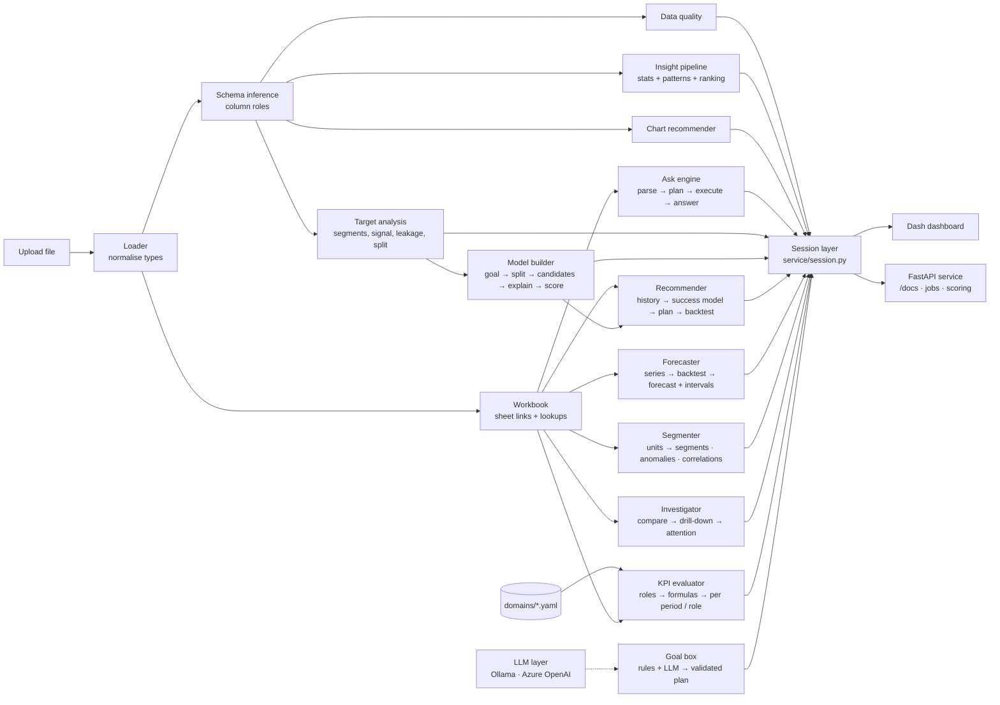

**Ask pipeline:** the question is parsed into intent, entity, filters, dates and chart type using the dataset's own column names and values → a validated query plan → executed with pandas → turned into a sentence, a table and (if useful) a chart. If the selected sheet can't answer, every linked sheet is tried and the best one is used.

More detail: [docs/ARCHITECTURE.md](docs/ARCHITECTURE.md).

## Quick start

**Requirements:** Python 3.10+ (developed on 3.12).

```bash
git clone https://github.com/kulkarniDurvesh/ai-data-scientist-platform.git
cd ai-data-scientist-platform

python -m venv .venv
# Windows
.venv\Scripts\activate
# macOS / Linux
source .venv/bin/activate

pip install -r requirements.txt
```

Run the HTTP API (interactive docs at <http://127.0.0.1:8000/docs>):

```bash
python -m api                    # or: docker compose up --build   (API :8000 + dashboard :8050)
```

Optional — a local language model for the goal box (the platform works without one):

```bash
ollama pull qwen3.5:4b           # CPU-friendly; any Ollama model works: set AIDS_LLM_MODEL
# or Azure OpenAI: set AIDS_AZURE_OPENAI_ENDPOINT, AIDS_AZURE_OPENAI_DEPLOYMENT, AIDS_AZURE_OPENAI_KEY
# AIDS_LLM_PROVIDER=ollama|azure|auto|none (default none: on a laptop CPU a 4B model takes ~45 s per goal)
```

Run the dashboard:

```bash
python app.py                                  # start empty, upload a file in the browser
python app.py --file path/to/data.xlsx         # preload a dataset
python app.py --file data.xlsx --sheet Visits  # pick an Excel sheet
python app.py --port 8060 --debug              # other port, Dash dev tools
```

Then open <http://127.0.0.1:8050>. Deep links open a tab directly: `?tab=overview|auto|builder|ask|target|model|recommend|forecast|segments|why|kpi|board`.

## Usage examples

Real outputs from the engine (full list with tables: [docs/examples/ask_examples.md](docs/examples/ask_examples.md)):

| Question | Answer |
|---|---|
| `which doctors are present in Pune North territory` | Found 50 doctors where Territory is Pune North. *(table with name, specialty, territory)* |
| `Among the Pune North Territory can you give me pie chart of doctors according to their speciality` | Pie chart · 4 groups; Cardiology is the largest (13 of 50). |
| `give list of doctors visited in month of March by MR01` | Found 34 doctors where Visit Date is in March and MRId is MR001. March appears in 2024 and 2025… *Answered from the 'Visits' sheet, with details from the 'Doctors' sheet.* |
| `how many doctors were visited in Q1 2025` | There are 498 doctors matching Last Visit Date is in Q1 2025. |
| `list all gizmos` | I couldn't match any column or value in that question… *(instead of returning every row)* |

The same engine on an unrelated retail dataset:

| Question | Answer |
|---|---|
| `list customers who ordered in March 2024` | Found 73 customers where order_date is in March 2024. |
| `In North, give me a pie chart of customers according to their categry` | Pie chart · 3 groups; Technology is the largest (134 of 380). |

Target analysis of `NextMonthOrder` (excerpt of the [generated report](docs/examples/target_report_NextMonthOrder.md)):

> Positive rate 7.52% · panel data 500 doctors × 21 months · **warning:** class imbalance (always predicting "no" would score 92.5%) · **split by time:** train Mar 2024–Jul 2025 (8,500 rows), test Aug–Nov 2025 (2,000 rows) — a random split would put ~99% of doctors in both sets · strongest segment: Territory (Solapur 11.8% vs Satara 5.5%, p = 4.4e-13) · strongest features: OrderRate, OrdersPlaced (AUC ≈ 0.89).

Build model, goal *Rank / prioritise*, target `NextMonthOrder` (time split: train Mar 2024–Jul 2025, test Aug–Nov 2025):

| Model | Validation PR-AUC | Test PR-AUC | Test ROC-AUC | Top 20% capture |
|---|---|---|---|---|
| Baseline (no features) | 0.073 | 0.077 | 0.500 | 16% |
| **Logistic regression (chosen)** | **0.442** | 0.405 | 0.922 | 85% |
| Random forest | 0.398 | 0.488 | 0.926 | 86% |
| Gradient boosting | 0.395 | 0.494 | 0.911 | 84% |

> The top 20% of the ranked doctor list captures **85% of next-month orderers** (4.3× the average rate). The model is selected on the validation window, not on the test period — which is why the slightly better test scores of the tree models don't change the choice.

Recommend tab on the *Visits* sheet (success = *Order Placed* or *Interested*, plan within territory, 6 visits per MR per day, 5 working days):

| Strategy (top 20% of each held-out week's visits) | Success rate | Lift |
|---|---|---|
| **Model** | **76.8%** | **2.9×** |
| Highest past success rate | 76.5% | 2.9× |
| Most overdue first | 27.9% | 1.05× |
| Random (no prioritisation) | 26.5% | 1.0× |

> Prioritising by the model nearly triples the success rate of visits. In this synthetic data each doctor's propensity is stable, so the simple *past success rate* rule performs almost as well — the backtest makes that visible instead of hiding it. *Most overdue first* does not help.
>
> **Next-month plan (January 2026):** 1,464 visits for 50 MRs over 22 working days; every doctor stays with one MR of their territory; at most 4 visits per MR per day, spread evenly (MR001: 29 visits on 17 days across their 10 doctors); at least 10 days between visits to the same doctor.

Forecast tab, *OrderDetails* sheet, monthly **estimated revenue** split by territory, 3 months ahead (24 months of history):

| Model | MASE | sMAPE |
|---|---|---|
| **ARIMA(1,1,1) (chosen)** | **0.70** | 51% |
| Theta | 0.71 | 52% |
| ETS | 0.72 | 53% |
| Gradient boosting (lags, all series) | 0.79 | 55% |
| Naive (baseline) | 0.89 | 72% |
| Seasonal naive (baseline) | 0.93 | 67% |

> Total forecast for Jan–Mar 2026: about 254k, with 80% and 95% intervals. Monthly **visit counts** from the *Visits* sheet forecast with sMAPE ≈ 3% (ETS). Errors per territory are larger than for the total because the per-territory series are small and volatile.

Segments tab, one unit per doctor (500), 13 behaviour features, 4 segments:

| Segment | Share | What sets it apart |
|---|---|---|
| High Not Interested, Low Interest Rate | 34% | not interested 17.3 vs 8.5 on average; interest rate 0.01 vs 0.21 |
| High Follow Up Rate, Low Total Visits | 24% | follow-up rate 0.46 vs 0.29; fewer visits |
| High Follow Up Required, High Follow Up Rate | 22% | follow-ups 11.1 vs 6.2 |
| High Orders Placed, High Order Rate | 20% | orders 5.8 vs 1.3; order rate 0.27 vs 0.06 |

> The correlation report also finds that `TotalVisits` is an exact sum of the outcome counts (VIF ∞) and that `OrdersPlaced` / `OrderRate` are almost the same signal (ρ = 0.999) — useful before modelling.

Investigate tab, *OrderDetails*, monthly estimated revenue, December vs November 2025:

> Total estimated revenue rose from 76,725 to 87,100 (+13.5%). The biggest contributor is Territory = Pune North (+15,375, more than the whole net change: other groups moved the other way, the largest being Solapur −13,025). No single territory accounts for more than 23% of all movement, so the change is spread out. Attention ranking by MR: MR022 first (down 100% vs November, trend falling 25% per month).

On data with a planted cause (one rep's sales of one product collapsing in one region), the chain goes *product → region → rep* and ends at the exact cause (−98%).

KPIs tab with `domains/pharma_sfa.yaml`, December vs November 2025:

| KPI | Dec 2025 | Change | |
|---|---|---|---|
| Visit completion | 92.4% | −1.4 pts | worse |
| Cancellation rate | 7.6% | +1.4 pts | worse (lower is better) |
| Order conversion | 7.8% | +1.1 pts | better |
| Doctor coverage | 77.6% | −0.2 pts | worse |
| Revenue | 87,100 | +10,375 | better |

> Broken down by MR, *Doctor coverage* is reported as not available — the Doctors sheet has no MR column — instead of a wrong number.

## Project structure

```
.
├── app.py                     # entry point: python app.py [--file ...]
├── core/                      # domain-agnostic analysis engine
│   ├── loader.py              # file loading + type normalisation
│   ├── schema_inference.py    # column roles, naming helpers
│   ├── data_quality.py        # quality checks
│   ├── profiler.py, relationships.py, statistics.py, patterns.py,
│   │   insight_filter.py, evidence.py, explanations.py, ranking.py,
│   │   insight.py, eda_pipeline.py   # automatic insight pipeline
│   ├── date_parts.py          # "March 2025", "Q1" → date filters
│   ├── workbook.py            # multi-sheet links and lookups
│   ├── target_analysis.py     # target-aware EDA + Markdown report
│   ├── modeling/              # goal → features → split → candidates → explain → score → registry
│   ├── recommend/             # roles → point-in-time history → success model → daily plan → backtest
│   ├── forecast/              # series → models → rolling backtest → forecast with intervals
│   ├── segment/               # units → correlations → segments with profiles → anomalies with reasons
│   ├── why/                   # period comparison → drill-down explanation → unusual groups → attention
│   ├── kpi/                   # domain files: config model, safe evaluator, starter generator
│   ├── llm/                   # language-model providers (Ollama, Azure OpenAI) + validated structured output
│   ├── intent/                # goal box: rules → language model → validation → plan; suggestions
│   ├── narrate/               # fact sheets, template summaries, number-checked model summaries
│   └── NLP/                   # Ask engine: parser → planner → engine → answer
├── visualization/             # chart specs, recommender, engine, renderer, validator
├── service/                   # session layer shared by the dashboard and the API
├── ui/                        # Dash app: layout, callbacks, panels, styles
├── api/                       # FastAPI service: endpoints, schemas, result views
├── domains/                   # optional domain files (roles + KPI formulas); the only place for domain terms
├── evals/                     # evaluation sets (goals, questions) + runner: python -m evals [--model]
├── tests/                     # pytest suite on synthetic, non-pharma datasets
└── docs/                      # architecture, user guide, roadmap, screenshots, examples
```

## Design principles

- **Generic by construction** — no column, sheet or dataset names in the code; behaviour comes from data, column roles and naming conventions.
- **Compute, don't guess** — every number comes from deterministic code; future AI layers explain and orchestrate but never invent values.
- **Honest by default** — leakage checks, time-aware splits, baselines, and clear messages when something can't be answered.
- **Tested on unrelated data** — tests use synthetic retail, store and shipment datasets to prove nothing depends on the pharma schema.

## Testing

```bash
pip install -r requirements-dev.txt
python -m pytest -q
python -m evals                  # interpretation accuracy (rules); --model adds the language model
```

The suite (134 tests) covers schema inference, data quality, charts, the Ask engine (dates, lists, charts, fuzzy matching, routing), multi-sheet linking, target analysis (leakage, segments, panel split), the model builder (beats the baseline, leak exclusion, non-overlapping time windows, registry round trip, background jobs), the recommender (point-in-time features, every planning rule, month plans with one MR per doctor and levelled load, backtest beats random, flat tables without lookup sheets), forecasting (bucketing and splits add up, incomplete periods, defaults, models beat baselines, interval coverage), segmentation (planted groups recovered, planted outliers flagged, redundancy and exact totals found, bands), why-analysis (planted cause found, contributions add up, pure mix shift separated, collapsing entity ranked first, why-questions), KPIs (hand-checked values, cross-table ratios, unavailable reasons, partial periods, starter files), the HTTP API (every endpoint, jobs, saved-model scoring, API key), the goal box (rules for every task, unknown words reported, invented columns turned into questions, corrections, suggestions, scripted language-model replies, fallback when the model fails, structured-output retries, running goals), the language-model features (Ask fallback computed by pandas, unknown values and columns refused, rules never call the model, number-checked summaries, evaluation sets) and dashboard rendering.

## Roadmap

| Phase | Plan | Key technologies |
|---|---|---|
| ✅ 3a | Goal-driven model builder: classification, ranking, regression | scikit-learn |
| ✅ 3b | Recommendation: next-best-contact model, daily plans, backtest | scikit-learn |
| ✅ 3c | Forecasting with rolling backtests and intervals | statsmodels, scikit-learn |
| ✅ 3d | Segmentation, anomaly detection, correlation | scikit-learn |
| ✅ 4a | "Why" tools: period comparison, drill-down, unusual groups, attention ranking | pandas |
| ✅ 4b | KPI definitions layer (optional domain config) | PyYAML |
| ✅ 5 | Python service with typed endpoints | FastAPI, Pydantic, Docker |
| ✅ 6a | LLM layer (one interface for local and cloud models, validated structured output) and the **free-text goal box** ([design](#free-text-goals-phase-6a)) | Ollama, Azure OpenAI, Pydantic |
| ✅ 6b | LLM fallback for the Ask box, grounded summaries, evaluation sets | Ollama, Azure OpenAI |
| 7 | RAG over SOP/policy/product documents with citations and retrieval metrics | ChromaDB, Azure AI Search |
| 8 | Agentic AI: free-text goal → plan → clarifying questions → pipelines; analyst agent; MCP server; multi-agent | Microsoft Agent Framework, MCP |
| 9 | On-demand Azure deployment, deleted automatically after use | Bicep deployment stacks, Container Apps, Key Vault, managed identity |
| 10 | Pharma SFA integration and a .NET Manager Agent | ASP.NET Core, Semantic Kernel / Agent Framework |
| 11 | Evaluation in CI, tracing, security, Responsible AI | GitHub Actions, Application Insights, Entra ID |

Details, done-criteria and learning goals per phase: [docs/ROADMAP.md](docs/ROADMAP.md).

### Free-text goals (Phase 6a)

Instead of filling in options, the user types what they want, for example:

> *"Please create a recommendation engine to recommend the next visit to doctors by MR in their own area / territory"*

and the platform shows its interpretation, asks for what is missing, and builds it on confirmation:

```
Free text ─► interpreter (rules first, LLM when uncertain) ─► structured spec
           ─► validated against the real columns ─► "Here's what I understood" card
              (each part linked to a column, with confidence) + questions for missing facts
           ─► confirm ─► the existing, tested pipeline runs
```

| | Approach | Role |
|---|---|---|
| **C** | Hybrid interpreter: rules match the dataset's own names; an LLM handles synonyms, abbreviations and free phrasing ("physicians", "reps", "region"), constrained to the spec's schema | Main path |
| **D** | Guided questions with detected options to click | Fallback when the text can't be interpreted |
| **E** | Goals suggested from the data ("Recommend next DoctorId for each MRId within Territory", "Forecast EstimatedRevenue by month") | One-click start |

Why not rules alone: a test on the real workbook showed rules handle wording that reuses the data's names (*doctors → DoctorId, MR → MRId, territory → Territory*) but miss synonyms and abbreviations; a synonym list would be domain-specific and break the generic design. Nothing runs without confirmation, and an LLM never passes a column that doesn't exist.

## Tech stack

| Layer | Now | Planned |
|---|---|---|
| Analysis / ML | pandas, NumPy, SciPy, scikit-learn, statsmodels, PyYAML | – |
| UI | Dash, Plotly | Angular (SFA app) |
| Service | FastAPI, Pydantic, uvicorn, Docker | Azure Container Apps |
| AI | Rule-based NL engine; LLM layer (Ollama, Azure OpenAI) with Pydantic-validated structured output; goal interpreter | RAG, agents, MCP |
| Cloud | — | Azure (Bicep, Container Apps, AI Search, Key Vault, App Insights) |
| Testing | pytest | GitHub Actions, LLM/RAG/agent evaluation sets |

## Documentation

| Document | Contents |
|---|---|
| [docs/USER_GUIDE.md](docs/USER_GUIDE.md) | Every tab, the questions the Ask box understands, reading the Target tab, troubleshooting |
| [docs/ARCHITECTURE.md](docs/ARCHITECTURE.md) | Modules, data flow, Ask pipeline, sheet linking, target analysis, design decisions |
| [docs/API.md](docs/API.md) | HTTP API: concepts, endpoints, curl and C# examples, settings |
| [docs/ROADMAP.md](docs/ROADMAP.md) | Phases, deliverables, done-criteria |
| [docs/examples/](docs/examples/) | Real outputs: Ask answers and a generated target report |

## Data notice

The pharma SFA workbook used in the screenshots and examples is **synthetic**, generated for learning; it contains no real doctor, patient or company data. Results on synthetic data demonstrate the method, not business performance.

## Author

**Durvesh Kulkarni** ([@kulkarniDurvesh](https://github.com/kulkarniDurvesh)) — building this project to learn and demonstrate end-to-end AI engineering: data understanding, machine learning, LLMs, RAG, agentic AI and Azure.

## License

Released under the [MIT License](LICENSE).
