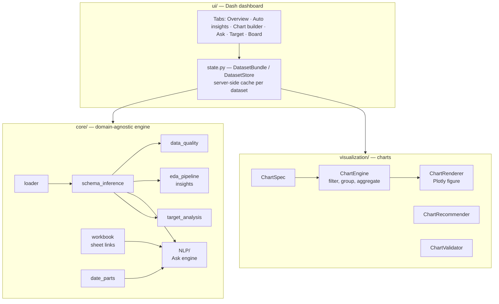
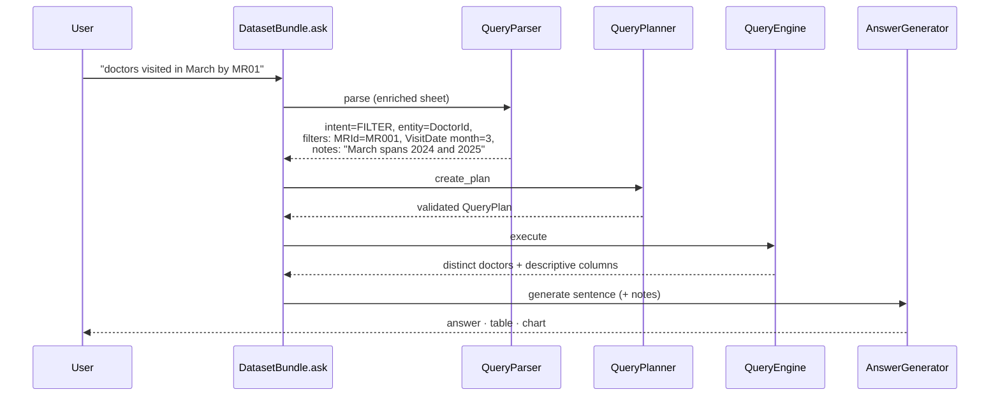
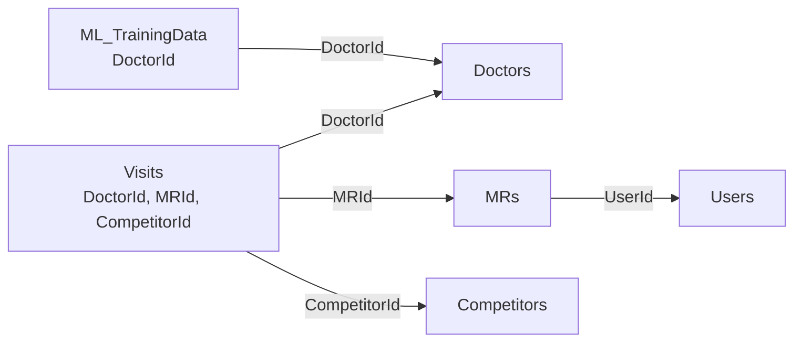
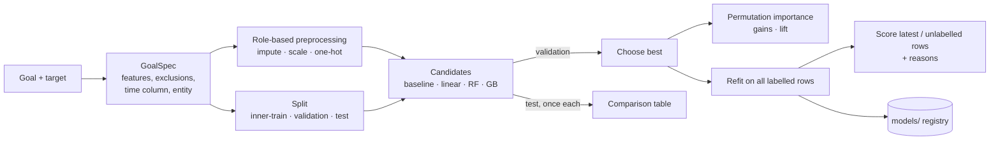
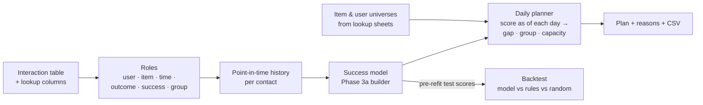
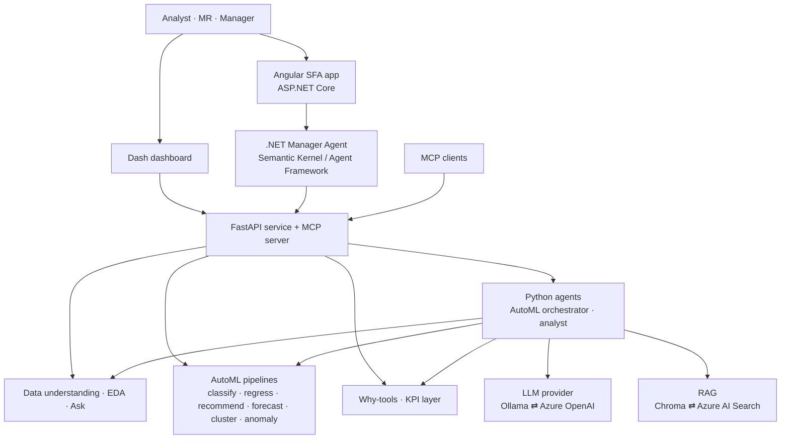

# Architecture

This document explains how the platform is organised today and how the planned AI layers fit on top.

- [Layers](#layers)
- [Module map](#module-map)
- [Data flow](#data-flow)
- [Ask pipeline](#ask-pipeline)
- [Multi-sheet linking and routing](#multi-sheet-linking-and-routing)
- [Target analysis](#target-analysis)
- [Model builder](#model-builder)
- [Recommender](#recommender)
- [Dashboard state](#dashboard-state)
- [Key design decisions](#key-design-decisions)
- [Planned architecture](#planned-architecture)

---

## Layers

**Rule:** `core/` never imports from `ui/`. `visualization/` depends only on `core` helpers. The UI holds no analysis logic.

## Module map

| Module | Responsibility |
|---|---|
| `core/loader.py` | Read CSV/TSV/Excel/JSON/Parquet; normalise numeric and date text; `load_all_sheets` reads a workbook in one pass |
| `core/schema_inference.py` | Column roles (`measure`, `dimension`, `binary`, `time`, `identifier`, `text`, `constant`, `empty`), kinds, primary time axis; naming helpers (`name_tokens`, `key_entity_name`, `is_identifier`, `same_word`) |
| `core/data_quality.py` | Quality findings with severities |
| `core/profiler.py` … `core/insight.py`, `core/eda_pipeline.py` | Insight pipeline: profile → candidate pairs → statistics → patterns → redundancy filter → evidence → explanations → ranking |
| `core/date_parts.py` | Detect "March 2025", "Q1", "in 2024"; choose the date column from question words; date-part masks |
| `core/workbook.py` | Load all sheets, detect key links, build enriched (looked-up) frames |
| `core/target_analysis.py` | Target detection and the target report (segments, feature signal, leakage, panel, split, drift, Markdown) |
| `core/recommend/` | Recommendation: `roles` (user / item / time / outcome / success / group detection), `history` (point-in-time features and as-of snapshots), `planner` (daily plans under capacity, gap and group rules), `backtest` (strategy comparison on held-out weeks), `engine` (orchestration) |
| `core/modeling/` | Goal-driven model builder: `goal` (GoalSpec), `features` (role-based preprocessing), `split` (time / stratified windows), `models` (candidates, metrics, lift), `explain` (permutation importance, per-row reasons), `builder` (orchestration), `registry` (save / list / load) |
| `core/NLP/query_parser.py` | Question → `ParsedQuery` (intent, entity, filters, dates, group-by, chart type, notes, unresolved values) |
| `core/NLP/query_plan.py` | `ParsedQuery` → validated `QueryPlan` |
| `core/NLP/query_engine.py` | Execute a plan with pandas (aggregates, rankings, distinct lists with attributes, chart tables) |
| `core/NLP/answer_generator.py` | Plan + result → sentence |
| `visualization/*` | Chart specification, recommendation, validation, computation, rendering, mapping from insights/plans to charts |
| `ui/state.py` | Per-dataset cache: quality, insights, charts registry, ask history, workbook, ask contexts per sheet, target reports |
| `ui/app.py`, `ui/panels.py`, `ui/components.py` | Layout, callbacks, tab content, reusable components |

## Data flow

1. **Load** — `DatasetStore.load()` reads the selected sheet, infers the schema and starts a background warm-up (quality, recommendations, insights, workbook links).
2. **Explore** — tabs read cached results from the `DatasetBundle`; charts are described by a `ChartSpec`, registered under a stable key (so they can be pinned) and rendered on demand.
3. **Ask** — see below.
4. **Target** — `analyze_target()` runs on demand per chosen target and is cached.

## Ask pipeline

**Parser steps (all driven by the dataset's own columns and values):**

| Step | How |
|---|---|
| Normalise | Split run-together words (`doctorsId` → `doctors id`) unless the word is itself a column or value |
| Intent | Top/bottom N → chart request → keyword intents → list fallback ("which …") |
| Entity | Key columns name entities through their trailing key word (`DoctorId` → "doctor(s)"), only when the column has the identifier role |
| Filters | Numeric comparisons; categorical values found in the text (one column per value, preferring the column the question names); ID codes matched by `(prefix, number)` so `MR01` = `MR001` |
| Dates | `date_parts.detect_date_parts` + `choose_date_column` (question words vs column names, then primary time axis) |
| Charts | Chart type words; group-by from "by / per / according to / X-wise"; calendar units ("by month") use the date column with a time grain |
| Safety | Values found in no column are reported as *unresolved*; a list request matching nothing is refused instead of returning every row |

## Multi-sheet linking and routing

- **Link detection:** a column with the identifier role in sheet A whose (normalised) name matches a column in sheet B where every value is unique, and ≥ 50% of A's key values exist in B.
- **Enrichment:** breadth-first lookups up to two links deep (Visits → MRs → Users). The base sheet's own columns win; a name brought by two lookup sheets is labelled by sheet (`Doctors Territory`, `MRs Territory`). Rows are never duplicated (lookups only, no many-to-many joins).
- **Routing:** each question is tried on the enriched selected sheet; if it fails (unresolved value, no matching column, no date column), every other sheet is tried and the best attempt wins by: number of resolved elements → sheet name mentioned in the question ("visited" ~ Visits) → selected sheet. The answer names the sheet used and the lookup sheets that contributed.
- **Charts from other sheets** remember their sheet so they render correctly on the board.

## Target analysis

| Step | Method |
|---|---|
| Target candidates | Two-valued columns preferred; outcome-like names (`next`, `target`, `label`, `churn`…), 0/1 coding and position add weight |
| Encoding | Positive class = `1/true/yes`, else the rarer value |
| Segments | Groups < 20 rows folded into "Other"; chi-square test and Cramér's V (binary) or ANOVA and eta (numeric) |
| Feature signal | Univariate AUC via Mann–Whitney U (binary) or Spearman (numeric); target rate by quartile |
| Snapshot time | Date column with a regular period whose values sit on period boundaries (e.g. 1st of month) |
| Panel | Identifier with repeated values and unique (entity, time) pairs |
| Leakage | AUC ≥ 0.98, \|correlation\| ≥ 0.98, Cramér's V ≥ 0.9, target copies, future-sounding names, dates after the snapshot period end |
| Split | Train on the first ~80% of periods, test on the rest; for panels, expected share of entities a random split would leak into both sets |

## Model builder

| Step | Method |
|---|---|
| GoalSpec | Built from the target report: excluded columns (IDs, dates, constants, text, critical leakage), dimensions with > 50 categories dropped; snapshot time column and panel entity reused |
| Preprocessing | `ColumnTransformer`: numeric → median impute (+ standard scaling for linear models); categorical → "Missing" fill + one-hot with rare levels grouped (< 1%) |
| Split | Dated: test = last ~20% of periods (same cut as the Target tab), validation = last ~20% of the remaining periods. Undated: stratified (yes/no) or random |
| Selection | Highest validation PR-AUC (yes/no) or lowest validation MAE (numbers); the baseline is never chosen |
| Imbalance | `class_weight="balanced"` for logistic regression and gradient boosting, `balanced_subsample` for the random forest |
| Explanations | Permutation importance on up to 3,000 test rows; per-row reasons from the top columns, using the direction of each column's relation to the predictions and mid-rank percentiles |
| Scoring | Unlabelled rows if any, else the latest period, else all rows; the final model is refit on all labelled rows |
| Background jobs | `DatasetBundle.start_model_job` runs `build_model` in a thread; a `dcc.Interval` polls progress messages |

## Recommender

| Step | Method |
|---|---|
| Interaction sheets | A sheet qualifies when it has two repeated identifier columns, a date column and a low-cardinality outcome with at least one positive value |
| Roles | Item = repeated key with most distinct values, user = the next; event date = most-filled, irregular, most distinct date; success values = positive words without negations; group = same column name on the user's and the item's lookup sheet, else a column constant per user and per item |
| History features | Sorted by item and time; cumulative counts shifted by one so the current contact is excluded; 90-day window by binary search; as-of snapshots use only rows strictly before the date |
| Model | `GoalSpec(goal_type="rank", target="Success")` through `build_model`, so splits, candidates, selection and explanations are shared with Phase 3a |
| Universes | Items from the item lookup sheet (all doctors, including never-visited ones) plus any extra items seen in interactions; users from the user lookup sheet; groups from lookup columns or per-key modes |
| Planner | Per day: as-of scoring, gap filter (real contacts and earlier planned days), per-group round-robin up to capacity; weekends skipped |
| Backtest | Uses the chosen model's test-window predictions made **before** the final refit, so no test outcome leaks into the comparison |

## Dashboard state

Dash stores live in the browser as JSON, so data never goes there. The browser holds only the dataset id and pinned chart keys; `ui/state.py` keeps dataframes, schemas, caches and chart specs server-side (`DatasetStore`, last 4 datasets).

## Key design decisions

| Decision | Why |
|---|---|
| No hardcoded column names; roles + naming conventions | Works on any dataset; proven by tests on unrelated schemas |
| Identifier role, not "name ends with id" | `AmountPaid` is not a key; `ShipmentNo` is |
| Rule-based Ask engine first | Exact, free, testable; an LLM fallback is added later for unusual phrasing |
| Lookups only (no many-to-many joins) | Row counts stay correct; many-to-many questions are routed to the sheet that holds the facts |
| Refuse rather than mislead | A question with an unknown value or no match never silently returns all rows |
| Time-aware split advice | Panel data with a random split leaks entities and overstates accuracy |

## Planned architecture

The LLM orchestrates and explains; every number comes from the deterministic pipelines. See [ROADMAP.md](ROADMAP.md).
