# Architecture

This document explains how the platform is organised today and how the planned AI layers fit on top.

- [Layers](#layers)
- [Module map](#module-map)
- [Data flow](#data-flow)
- [Ask pipeline](#ask-pipeline)
- [Multi-sheet linking and routing](#multi-sheet-linking-and-routing)
- [Target analysis](#target-analysis)
- [Model builder](#model-builder)
- [Recommender](#recommender)
- [Forecaster](#forecaster)
- [Segmenter](#segmenter)
- [Investigator](#investigator)
- [KPI layer](#kpi-layer)
- [Dashboard state](#dashboard-state)
- [Key design decisions](#key-design-decisions)
- [Planned architecture](#planned-architecture)

---

## Layers

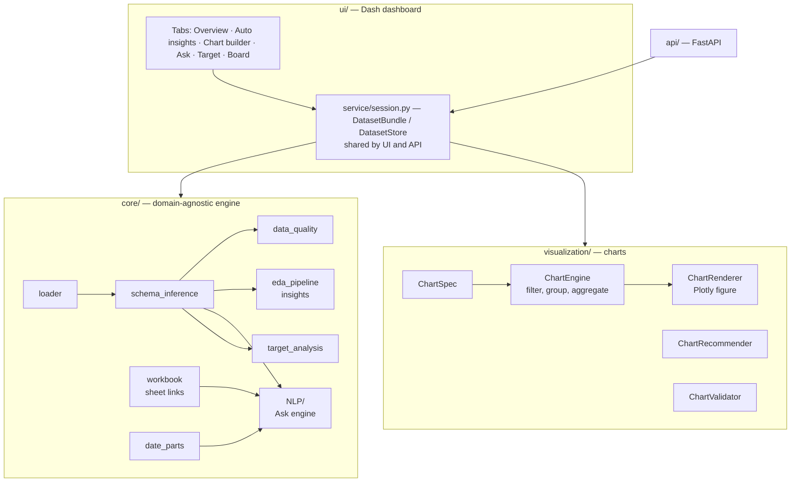

**Rule:** `core/` never imports from `ui/`. `visualization/` depends only on `core` helpers. The UI holds no analysis logic.

## Module map

| Module | Responsibility |
|---|---|
| `core/loader.py` | Read CSV/TSV/Excel/JSON/Parquet; normalise numeric and date text; `load_all_sheets` reads a workbook in one pass |
| `core/schema_inference.py` | Column roles (`measure`, `dimension`, `binary`, `time`, `identifier`, `text`, `constant`, `empty`), kinds, primary time axis; naming helpers (`name_tokens`, `key_entity_name`, `is_identifier`, `same_word`) |
| `core/data_quality.py` | Quality findings with severities |
| `core/profiler.py` … `core/insight.py`, `core/eda_pipeline.py` | Insight pipeline: profile → candidate pairs → statistics → patterns → redundancy filter → evidence → explanations → ranking |
| `core/date_parts.py` | Detect "March 2025", "Q1", "in 2024"; choose the date column from question words; date-part masks |
| `core/workbook.py` | Load all sheets, detect key links, build enriched (looked-up) frames |
| `core/target_analysis.py` | Target detection and the target report (segments, feature signal, leakage, panel, split, drift, Markdown) |
| `core/llm/` | Language-model layer: `provider` (one interface; Ollama, Azure OpenAI, scripted stand-in; settings from environment; availability check with reasons), `structured` (JSON-schema request, parse, Pydantic validation, one retry with the error) |
| `core/NLP/llm_query.py` | Ask fallback: table description for the model, `QueryProposal` schema, validation into a `ParsedQuery` (columns matched, filter values must exist, numbers for numeric columns), description of the reading |
| `core/narrate/` | Summaries: `facts` (dataset and model fact sheets with formatted numbers), `write` (template text, language-model rewrite, number grounding check) |
| `evals/` | Evaluation sets (`goals.yaml`, `questions.yaml`) and runner (`python -m evals [--model] [--out]`) on the synthetic datasets |
| `core/intent/` | Goal box: `spec` (IntentSpec, GoalPlan, Question, task catalogue), `view` (tables a task can use), `rules` (generic cues, column and table name matching, time phrases, unknown words), `interpret_llm` (catalogue prompt, GoalProposal schema), `complete` (validation, corrections, defaults as assumptions, questions, summary), `engine` (hybrid interpret, suggestions) |
| `core/kpi/` | KPI layer: `config` (YAML schema, validation with readable errors, roles with per-table columns), `evaluate` (filters, aggregations, ratios, periods, breakdowns, unavailable reasons, partial-period check), `starter` (discover fitting domain files, generate a starter file) |
| `core/why/` | Why-analysis: `change` (periods, comparison, breakdown with mix / rate, drill-down chain and narrative), `attention` (group history, unusual groups, attention ranking), `engine` (explain-by and attention options, orchestration) |
| `core/segment/` | Segmentation: `units` (rows or per-key aggregation, feature choice), `correlation` (Spearman, redundant pairs, VIF, Cramér's V), `cluster` (preparation, k-means with silhouette, bands, profiles and names, PCA map), `anomaly` (Isolation Forest, robust-z reasons), `engine` (orchestration) |
| `core/forecast/` | Forecasting: `series` (spec, bucketing, gap filling, incomplete-period detection, defaults), `models` (naive, seasonal naive, drift, ETS, Theta, ARIMA, global gradient boosting on lags), `evaluate` (rolling-origin backtest, MAE / sMAPE / MASE, interval widths), `engine` (orchestration, STL diagnostics) |
| `core/recommend/` | Recommendation: `roles` (user / item / time / outcome / success / group detection), `history` (point-in-time features and as-of snapshots), `planner` (daily plans under capacity, gap and group rules), `backtest` (strategy comparison on held-out weeks), `engine` (orchestration) |
| `core/modeling/` | Goal-driven model builder: `goal` (GoalSpec), `features` (role-based preprocessing), `split` (time / stratified windows), `models` (candidates, metrics, lift), `explain` (permutation importance, per-row reasons), `builder` (orchestration), `registry` (save / list / load) |
| `core/NLP/query_parser.py` | Question → `ParsedQuery` (intent, entity, filters, dates, group-by, chart type, notes, unresolved values) |
| `core/NLP/query_plan.py` | `ParsedQuery` → validated `QueryPlan` |
| `core/NLP/query_engine.py` | Execute a plan with pandas (aggregates, rankings, distinct lists with attributes, chart tables) |
| `core/NLP/answer_generator.py` | Plan + result → sentence |
| `visualization/*` | Chart specification, recommendation, validation, computation, rendering, mapping from insights/plans to charts |
| `service/session.py` | Session layer shared by the dashboard and the API: per-dataset cache (quality, insights, chart registry, ask history, workbook, ask contexts per sheet, target reports), background jobs, latest model / plan / forecast / segments / investigation |
| `api/` | FastAPI service: `main` (endpoints, API key, CORS, error mapping), `schemas` (Pydantic request / response models), `results` (JSON views of result objects), `convert` (JSON-safe values and tables) |
| `ui/app.py`, `ui/panels.py`, `ui/components.py` | Layout, callbacks, tab content, reusable components |

## Data flow

1. **Load** — `DatasetStore.load()` reads the selected sheet, infers the schema and starts a background warm-up (quality, recommendations, insights, workbook links).
2. **Explore** — tabs read cached results from the `DatasetBundle`; charts are described by a `ChartSpec`, registered under a stable key (so they can be pinned) and rendered on demand.
3. **Ask** — see below.
4. **Target** — `analyze_target()` runs on demand per chosen target and is cached.

## Ask pipeline

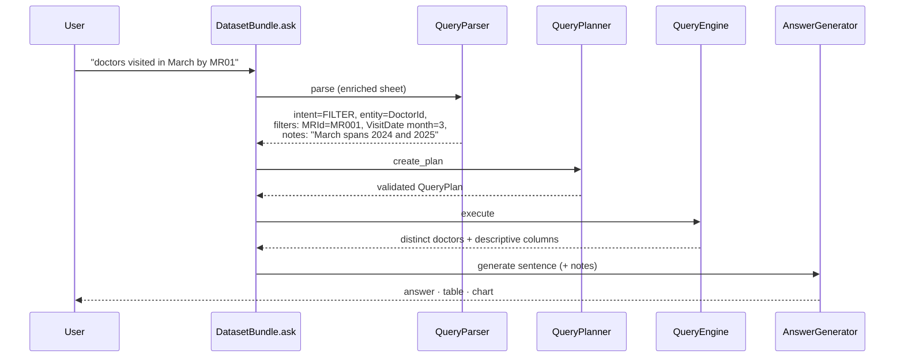

**Parser steps (all driven by the dataset's own columns and values):**

| Step | How |
|---|---|
| Normalise | Split run-together words (`doctorsId` → `doctors id`) unless the word is itself a column or value |
| Intent | Top/bottom N → chart request → keyword intents → list fallback ("which …") |
| Entity | Key columns name entities through their trailing key word (`DoctorId` → "doctor(s)"), only when the column has the identifier role |
| Filters | Numeric comparisons; categorical values found in the text (one column per value, preferring the column the question names); ID codes matched by `(prefix, number)` so `MR01` = `MR001` |
| Dates | `date_parts.detect_date_parts` + `choose_date_column` (question words vs column names, then primary time axis) |
| Charts | Chart type words; group-by from "by / per / according to / X-wise"; calendar units ("by month") use the date column with a time grain |
| Safety | Values found in no column are reported as *unresolved*; a list request matching nothing is refused instead of returning every row |

## Multi-sheet linking and routing

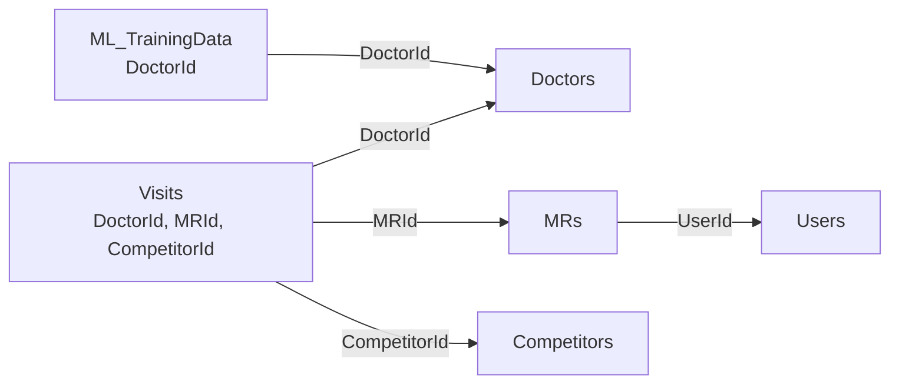

- **Link detection:** a column with the identifier role in sheet A whose (normalised) name matches a column in sheet B where every value is unique, and ≥ 50% of A's key values exist in B.
- **Enrichment:** breadth-first lookups up to two links deep (Visits → MRs → Users). The base sheet's own columns win; a name brought by two lookup sheets is labelled by sheet (`Doctors Territory`, `MRs Territory`). Rows are never duplicated (lookups only, no many-to-many joins).
- **Routing:** each question is tried on the enriched selected sheet; if it fails (unresolved value, no matching column, no date column), every other sheet is tried and the best attempt wins by: number of resolved elements → sheet name mentioned in the question ("visited" ~ Visits) → selected sheet. The answer names the sheet used and the lookup sheets that contributed.
- **Charts from other sheets** remember their sheet so they render correctly on the board.

## Target analysis

| Step | Method |
|---|---|
| Target candidates | Two-valued columns preferred; outcome-like names (`next`, `target`, `label`, `churn`…), 0/1 coding and position add weight |
| Encoding | Positive class = `1/true/yes`, else the rarer value |
| Segments | Groups < 20 rows folded into "Other"; chi-square test and Cramér's V (binary) or ANOVA and eta (numeric) |
| Feature signal | Univariate AUC via Mann–Whitney U (binary) or Spearman (numeric); target rate by quartile |
| Snapshot time | Date column with a regular period whose values sit on period boundaries (e.g. 1st of month) |
| Panel | Identifier with repeated values and unique (entity, time) pairs |
| Leakage | AUC ≥ 0.98, \|correlation\| ≥ 0.98, Cramér's V ≥ 0.9, target copies, future-sounding names, dates after the snapshot period end |
| Split | Train on the first ~80% of periods, test on the rest; for panels, expected share of entities a random split would leak into both sets |

## Model builder

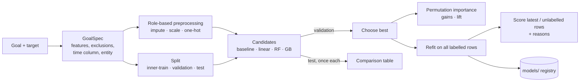

| Step | Method |
|---|---|
| GoalSpec | Built from the target report: excluded columns (IDs, dates, constants, text, critical leakage), dimensions with > 50 categories dropped; snapshot time column and panel entity reused |
| Preprocessing | `ColumnTransformer`: numeric → median impute (+ standard scaling for linear models); categorical → "Missing" fill + one-hot with rare levels grouped (< 1%) |
| Split | Dated: test = last ~20% of periods (same cut as the Target tab), validation = last ~20% of the remaining periods. Undated: stratified (yes/no) or random |
| Selection | Highest validation PR-AUC (yes/no) or lowest validation MAE (numbers); the baseline is never chosen |
| Imbalance | `class_weight="balanced"` for logistic regression and gradient boosting, `balanced_subsample` for the random forest |
| Explanations | Permutation importance on up to 3,000 test rows; per-row reasons from the top columns, using the direction of each column's relation to the predictions and mid-rank percentiles |
| Scoring | Unlabelled rows if any, else the latest period, else all rows; the final model is refit on all labelled rows |
| Background jobs | `DatasetBundle.start_model_job` runs `build_model` in a thread; a `dcc.Interval` polls progress messages |

## Recommender

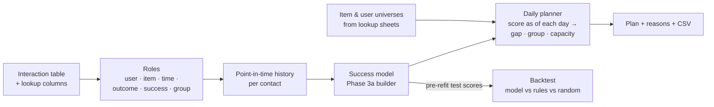

| Step | Method |
|---|---|
| Interaction sheets | A sheet qualifies when it has two repeated identifier columns, a date column and a low-cardinality outcome with at least one positive value |
| Roles | Item = repeated key with most distinct values, user = the next; event date = most-filled, irregular, most distinct date; success values = positive words without negations; group = same column name on the user's and the item's lookup sheet, else a column constant per user and per item |
| History features | Sorted by item and time; cumulative counts shifted by one so the current contact is excluded; 90-day window by binary search; as-of snapshots use only rows strictly before the date |
| Model | `GoalSpec(goal_type="rank", target="Success")` through `build_model`, so splits, candidates, selection and explanations are shared with Phase 3a |
| Universes | Items from the item lookup sheet (all doctors, including never-visited ones) plus any extra items seen in interactions; users from the user lookup sheet; groups from lookup columns or per-key modes |
| Planner | Period: N working days or a whole calendar month (weekends skipped). Ownership: per group, items sorted by their strongest past contact count and assigned to the in-group user with most contacts, subject to an even quota. Load levelling: daily limit = min(capacity, ⌈items owned × ⌈span / gap⌉ / days⌉). Per day: as-of scoring, gap filter (real contacts and earlier planned days), each user's best eligible items up to the limit (or a per-group round-robin when ownership is off) |
| Backtest | Uses the chosen model's test-window predictions made **before** the final refit, so no test outcome leaks into the comparison |

## Forecaster

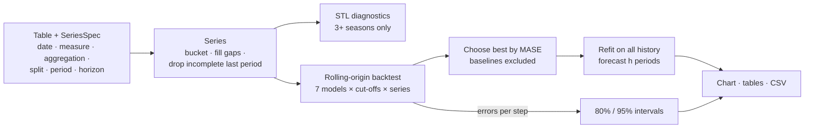

| Step | Method |
|---|---|
| Defaults | Measures ranked: row-level before per-key attributes and lookup columns, then non-ratio, then largest total; period from the date's native grain or its span |
| Incomplete period | The last period is dropped when the data covers less than 80% of it (event data only) |
| Backtest | Up to 4 cut-offs near the end, spaced by half the horizon; local models per series, the gradient-boosting model trained across all series (scaled by each series' mean) and forecast recursively |
| Metrics | MAE, sMAPE, MASE (scaled by each history's in-sample seasonal-naive MAE) |
| Intervals | Standard deviation of the chosen model's backtest errors per step (pooled and widened with √step when sparse), made non-decreasing; ±1.28σ / ±1.96σ; floored at 0 for non-negative series |
| Diagnostics | STL (robust) with the season length (12 months, 52 weeks, 7 days, 4 quarters); strength = 1 − Var(remainder) / Var(component + remainder) |

## Segmenter

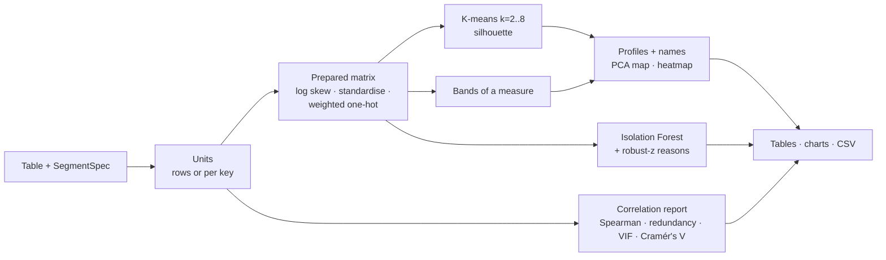

| Step | Method |
|---|---|
| Features | Measures, numeric 0/1 columns, categories with ≤ 15 levels; IDs, dates, text, constants and high-cardinality categories excluded with reasons |
| Preparation | Median impute; log1p for non-negative columns with skew > 1; z-score; one-hot divided by √levels |
| Choice of k | Silhouette on up to 3,000 units for k = 2–8; segments renumbered by size |
| Names | Top two traits by size of effect: standardised mean difference ≥ 0.5 ("High/Low X") or a category share ≥ 20 points above overall ("Mostly Y"); duplicates numbered |
| Anomalies | Isolation Forest (200 trees) on the same matrix; top share flagged; reasons from robust z = (x − median) / (1.4826·MAD), falling back to the standard deviation when MAD is 0, and categories under 2% |
| VIF | Each standardised numeric regressed on the others by least squares; R² ≈ 1 reported as ∞ with an "exact combination" note |

## Investigator

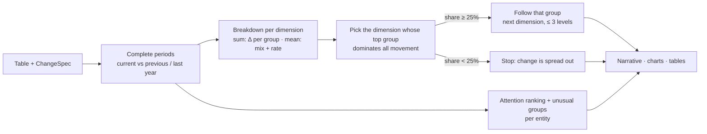

| Step | Method |
|---|---|
| Periods | Bucketed by the chosen grain; for event data a last period covering < 80% of its days is dropped; snapshot columns (native grain = chosen grain) are complete |
| Breakdown (sums, counts) | Change per group = current − previous; missing values grouped as "(missing)" so the parts add up to the total |
| Breakdown (averages) | Shift-share: mix = (w₁ − w₀)·r₀, rate = w₁·(r₁ − r₀) per group, summing to the change in the average |
| Concentration | \|change of the biggest group moving with the total\| ÷ Σ\|changes\| (0–1, can't exceed 1 when groups offset) |
| Explain-by options | Categories and keys with 2–100 values; one-to-one equivalent columns deduplicated; times of day excluded |
| Unusual groups | Robust z of the current value against the group's previous 12 periods (median, 1.4826·MAD; standard deviation if MAD is 0) |
| Attention score | 40 × min(fall %, 1) + 30 × min(\|z\| / 4, 1) + 20 × min(5 × falling trend, 1), scaled by the group's relative size, + 10 × share; only the "bad" direction counts |
| Ask integration | Questions starting with "why": measure via the parser (numeric column or counted entity), date named in the question or the main event date, all explain-by options; the first sheet that has the measure answers |

## KPI layer

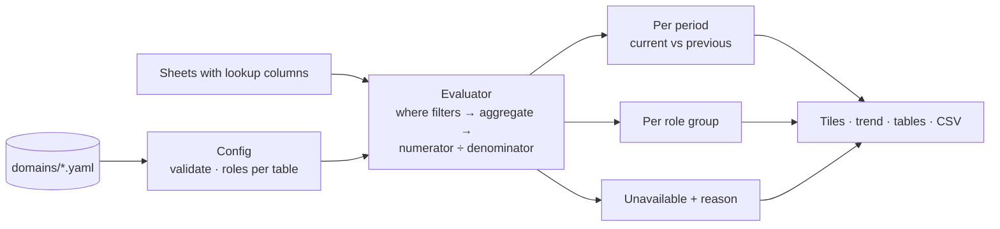

| Step | Method |
|---|---|
| Roles | `roles.<name>` is a column, or a sheet → column mapping (with `*` as default); anything that isn't a role is a column name |
| Aggregates | `count` (rows / non-null), `sum`, `mean`, `min`, `max`, `distinct`; each aggregate can use its own sheet (cross-sheet ratios) |
| Filters | Equality, membership (`[a, b]`) and comparisons (`gt ge lt le ne eq`); no expressions are evaluated |
| Periods | From the `date` role of each sheet; sheets without one (e.g. a master list of doctors) are not filtered by period; a last period covered < 80% by event data is dropped |
| Breakdown | Both numerator and denominator are grouped by the role's column in their own sheet; missing role → KPI unavailable for that breakdown |
| Starter file | Repeated keys → roles named after their entity, event date → `date`, small categories → roles; KPIs: row count, totals and averages of row-level measures, shares of small categories |

## Goal box

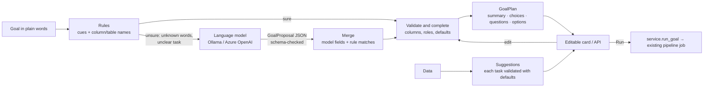

| Decision | Why |
|---|---|
| Rules first, model only when unsure | Fast, free and exact on the data's own names; the model is needed only for other words, so it runs rarely and the box works without it |
| One validator for every source | Rules, model output, suggestions and user edits all pass the same checks; a model can never pass a column that doesn't exist |
| Generic cues only | English task words (*forecast, why, plan, rank*) and name tokens; domain synonyms would break genericity, so they are left to the model |
| Partial name matches are "soft" | A guess from part of a name falls back to the default instead of raising a question; a full match that doesn't fit raises one |
| Unknown words are reported | "Not understood: 'clients'" instead of silently ignoring part of the goal |
| Defaults listed as choices | The user sees every automatic decision and can change it on the card |
| Same pipelines as the tabs | A goal starts the existing job; results open in the matching tab; nothing new computes numbers |

## Language model, grounded

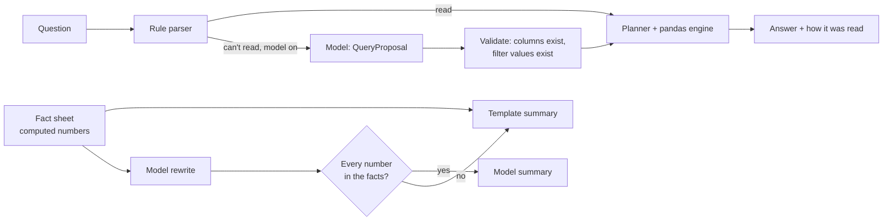

| Decision | Why |
|---|---|
| The model proposes queries, never answers | Numbers come from pandas on the real data; a wrong reading fails validation instead of producing a plausible wrong number |
| Filter values must exist | A misspelt or invented value is refused (the same rule now applies to the rule parser) |
| Rules first | Plain questions never wait for the model; the model is optional (`AIDS_LLM_PROVIDER`, default none) |
| Summaries from fact sheets | The model only rewrites computed facts; any number not in the facts rejects the rewrite |
| Evaluation sets in the repo | Interpretation quality is measured, not assumed; a case per wording type, plain and synonym cases reported separately |

## HTTP API

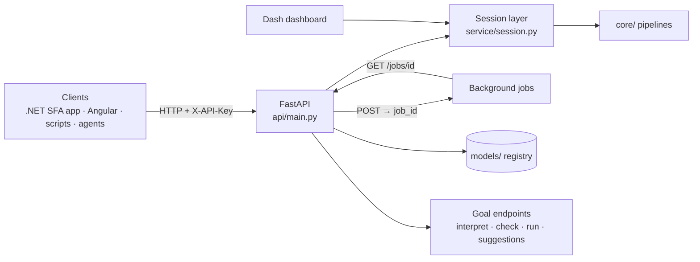

| Decision | Why |
|---|---|
| One session layer for UI and API | Same defaults and identical numbers in both; no analysis logic in either front end |
| Background jobs with polling | Training and planning take seconds; HTTP requests stay short and clients show progress |
| Fields optional, defaults automatic | A client can start with `{}` and override only what it knows |
| Pydantic models for requests and main responses | OpenAPI schema for typed client generation (.NET, TypeScript); readable 400 errors |
| Results as `{columns, rows, total_rows}` | One table shape for every client; long tables paged |
| Saved-model scoring endpoint | The SFA app can score its own rows with a model trained and validated here |

## Dashboard state

Dash stores live in the browser as JSON, so data never goes there. The browser holds only the dataset id and pinned chart keys; `service/session.py` keeps dataframes, schemas, caches and chart specs server-side (`DatasetStore`: last 4 datasets in the dashboard, last 8 in the API).

## Key design decisions

| Decision | Why |
|---|---|
| No hardcoded column names; roles + naming conventions | Works on any dataset; proven by tests on unrelated schemas |
| Identifier role, not "name ends with id" | `AmountPaid` is not a key; `ShipmentNo` is |
| Rule-based Ask engine first | Exact, free, testable; an LLM fallback is added later for unusual phrasing |
| Lookups only (no many-to-many joins) | Row counts stay correct; many-to-many questions are routed to the sheet that holds the facts |
| Refuse rather than mislead | A question with an unknown value or no match never silently returns all rows |
| Time-aware split advice | Panel data with a random split leaks entities and overstates accuracy |

## Planned architecture

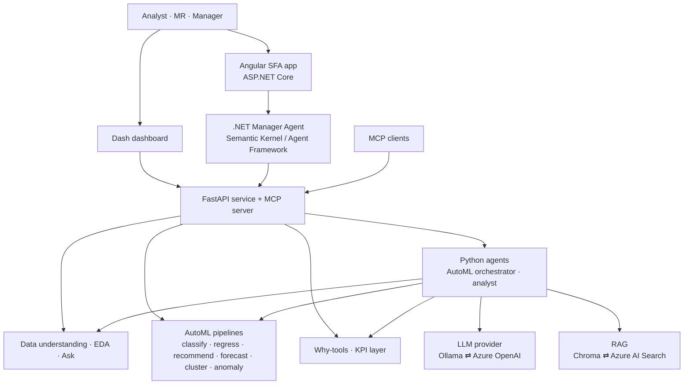

The LLM orchestrates and explains; every number comes from the deterministic pipelines. See [ROADMAP.md](ROADMAP.md).
